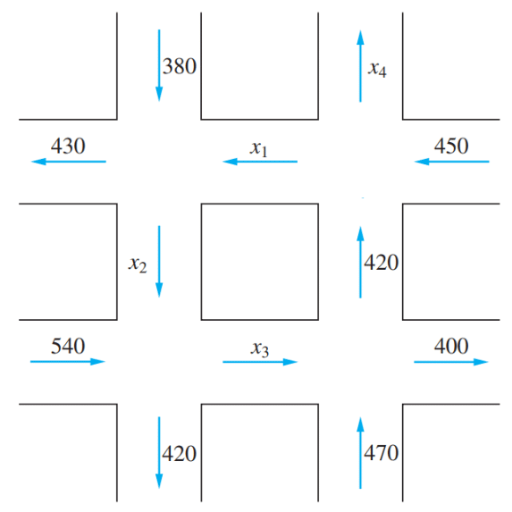

# Homework - Chapter 1

과제 제출 기간 : ~03.29일 금요일 자정(30일 00시00분)

## 1장 연습문제

### 1.1

#### 1

다음과 같은 각 방정식들의 시스템을 풀기 위하여 역바향 대입을 사용하라.

##### (a)

$$\begin{equation}
  \begin{aligned}
    x_1 + x_2 = 7 \\
    2x_2 = 6
  \end{aligned}
\end{equation}$$

$\begin{bmatrix} 1 & 1 & 7 \\ 0 & 2 & 6 \end{bmatrix}$

$\Rightarrow \begin{bmatrix} 1 & 1 & 7 \\ 0 & 1 & 3 \end{bmatrix}$

$\Rightarrow \begin{bmatrix} 1 & 0 & 4 \\ 0 & 1 & 3 \end{bmatrix}$

$\therefore x_1 = 4, x_2 = 3$

##### (b)

$$\begin{equation}
  \begin{aligned}
    x_1 + x_2 + x_3 = 10\\
    2x_2 + x_3 = 11\\
    2x_3 = 14
  \end{aligned}
\end{equation}$$

$\begin{bmatrix} 1 & 1 & 1 & 10 \\ 0 & 2 & 1 & 11 \\ 0 & 0 & 2 & 14 \end{bmatrix}$

$\Rightarrow \begin{bmatrix} 1 & 1 & 1 & 10 \\ 0 & 2 & 1 & 11 \\ 0 & 0 & 1 & 7 \end{bmatrix}$

$\Rightarrow \begin{bmatrix} 1 & 1 & 0 & 3 \\ 0 & 1 & 0 & 2 \\ 0 & 0 & 1 & 7 \end{bmatrix}$

$\Rightarrow \begin{bmatrix} 1 & 0 & 0 & 1 \\ 0 & 1 & 0 & 2 \\ 0 & 0 & 1 & 7 \end{bmatrix}$

$\therefore x_1 = 1, x_2 = 2, x_3 = 7$

##### (c)

$$\begin{equation}
  \begin{aligned}
    x_1 + 2x_2 + 3x_3 + 4x_4 &= 6\\
    7x_2 - x_3 + 2x_4 &= 5\\
    x_3 - 4x_4 &= -9\\
    4x_4 &= 8
  \end{aligned}
\end{equation}$$

$\left[\begin{array}{cccc|c} 1 & 2 & 3 & 4 & 6 \\ 0 & 7 & -1 & 2 & 5 \\ 0 & 0 & 1 & -4 & -9 \\ 0 & 0 & 0 & 4 & 8 \end{array}\right]$

$\Rightarrow \left[\begin{array}{cccc|c} 1 & 2 & 3 & 4 & 6 \\ 0 & 7 & -1 & 2 & 5 \\ 0 & 0 & 1 & -4 & -9 \\ 0 & 0 & 0 & 1 & 2 \end{array}\right]$

$\Rightarrow \left[\begin{array}{cccc|c} 1 & 2 & 3 & 0 & -2 \\ 0 & 7 & -1 & 0 & 1 \\ 0 & 0 & 1 & 0 & -1 \\ 0 & 0 & 0 & 1 & 2 \end{array}\right]$

$\Rightarrow \left[\begin{array}{cccc|c} 1 & 2 & 0 & 0 & 1 \\ 0 & 7 & 0 & 0 & 0 \\ 0 & 0 & 1 & 0 & -1 \\ 0 & 0 & 0 & 1 & 2 \end{array}\right]$

$\therefore x_1 = 1, x_2 = 0, x_3 = -1, x_4 = 2$

##### (d)

$$\begin{equation}
  \begin{aligned}
    x_1 + x_2 + 16x_3 + 3x_4 + x_5 &= 5\\
    4x_2 + 4x_3 + 6x_4 + 3x_5 &= 1\\
    -8x_3 + 27x_4 - 7x_5 &= 7\\
    3x_4 + 11x_5 &= 1\\
    x_5 &= 0
  \end{aligned}
\end{equation}$$

$\left[\begin{array}{ccccc|c}
  1 & 1 & 16 & 3 & 1 & 5 \\
  0 & 4 & 4 & 6 & 3 & 1 \\
  0 & 0 & -8 & 27 & -7 & 7 \\
  0 & 0 & 0 & 3 & 11 & 1 \\
  0 & 0 & 0 & 0 & 1 & 0
\end{array}\right]$

$\Rightarrow \left[\begin{array}{ccccc|c}
  1 & 1 & 16 & 3 & 0 & 5 \\
  0 & 4 & 4 & 6 & 0 & 1 \\
  0 & 0 & -8 & 27 & 0 & 7 \\
  0 & 0 & 0 & 3 & 0 & 1 \\
  0 & 0 & 0 & 0 & 1 & 0
\end{array}\right]$

$\Rightarrow \left[\begin{array}{ccccc|c}
  1 & 1 & 16 & 0 & 0 & 4 \\
  0 & 4 & 4 & 0 & 0 & -1 \\
  0 & 0 & -8 & 0 & 0 & -2 \\
  0 & 0 & 0 & 3 & 0 & 1 \\
  0 & 0 & 0 & 0 & 1 & 0
\end{array}\right]$

$\Rightarrow \left[\begin{array}{ccccc|c}
  1 & 1 & 0 & 0 & 0 & 0 \\
  0 & 4 & 0 & 0 & 0 & -2 \\
  0 & 0 & -4 & 0 & 0 & -1 \\
  0 & 0 & 0 & 3 & 0 & 1 \\
  0 & 0 & 0 & 0 & 1 & 0
\end{array}\right]$

$\Rightarrow \left[\begin{array}{ccccc|c}
  1 & 0 & 0 & 0 & 0 & \dfrac12 \\
  0 & 2 & 0 & 0 & 0 & -1 \\
  0 & 0 & 4 & 0 & 0 & 1 \\
  0 & 0 & 0 & 3 & 0 & 1 \\
  0 & 0 & 0 & 0 & 1 & 0
\end{array}\right]$

$\therefore x_1 = \dfrac12, x_2 = -\dfrac12, x_3 = \dfrac14, x_4 = \dfrac13, x_5 = 0$

#### 7

다음의 두 시스템은 계수 행렬은 같지만 우변이 다르다.

$$\begin{equation}
  \begin{aligned}
    x_1 + 2x_2 &= 8 \\
    4x_1 - 3x_2 &= -1
  \end{aligned}\qquad
  \begin{aligned}
    x_1 + 2x_2 &= 7 \\
    4x_1 - 3x_2 &= 6
  \end{aligned}
\end{equation}$$

다음의 증가된 행렬의 두 번째 행에 있는 첫 번째 원소를 제거하고 우변에 해당하는 각 열들에 대하여 역방향 대입을 수행하여 두 시스템의 해를 동시에 구하라.

$\left[\begin{array}{cc|cc} 1 & 2 & 8 & 7 \\ 4 & -3 & -1 & 6 \end{array}\right]$

$\Rightarrow \left[\begin{array}{cc|cc} 1 & 2 & 8 & 7 \\
0 & -11 & -33 & -22
\end{array}\right]$

$\Rightarrow \left[\begin{array}{cc|cc} 1 & 0 & 2 & 3 \\
0 & 1 & 3 & 2
\end{array}\right]$

$\therefore \left(x_1 = 2, x_2 = 3\right), \left(x_1 = 3, x_2 = 2\right)$

#### 8

다음 두 시스템의 해를 3 × 5 증가된 행렬에 대해 소거를 하고 역방향 대입을 두 번 시행하여 구하라.

$$\begin{equation}
  \begin{aligned}
    x_1 + 2x_2 - x_3 &= 6 \\
    2x_1 - x_2 + 3x_3 &= -3 \\
    x_1 + x_2 - 4x_3 &= 7
  \end{aligned}\qquad
  \begin{aligned}
    x_1 + 2x_2 - x_3 &= 9 \\
    2x_1 - x_2 + 3x_3 &= -2 \\
    x_1 + x_2 - 4x_3 &= 9
  \end{aligned}
\end{equation}$$

$\left[\begin{array}{ccc|cc}
1 & 2 & -1 & 6 & 9\\
2 & -1 & 3 & -3 & -2 \\
1 & 1 & -4 & 7 & 9
\end{array}\right]$

$\Rightarrow \left[\begin{array}{ccc|cc}
1 & 2 & -1 & 6 & 9\\
0 & -5 & 5 & -15 & -20 \\
0 & -1 & -3 & 1 & 0
\end{array}\right]$

$\Rightarrow \left[\begin{array}{ccc|cc}
1 & 2 & -1 & 6 & 9\\
0 & -1 & 1 & -3 & -4 \\
0 & 0 & -4 & 4 & 4
\end{array}\right]$

$\Rightarrow \left[\begin{array}{ccc|cc}
1 & 2 & 0 & 5 & 8\\
0 & 1 & 0 & 2 & 3 \\
0 & 0 & 1 & -1 & -1
\end{array}\right]$

$\Rightarrow \left[\begin{array}{ccc|cc}
1 & 0 & 0 & 1 & 2\\
0 & 1 & 0 & 2 & 3 \\
0 & 0 & 1 & -1 & -1
\end{array}\right]$

$\therefore \left(x_1 = 1, x_2 = 2, x_3 = -1\right), \left(x_1 = 2, x_2 = 3, x_3 = -1\right)$

### 1.2

#### 2

다음의 각각에서, 증가된 행렬이 행 사다리꼴 형태이다. 각 경우에 대하여, 대응하는 선형 시스템이 모순이 아닌지 표시하라. 만일 그 시스템이 유일한 해를 갖는다면 그 해를 구하라.

##### (a)

$\left[\begin{array}{cc|c}
1 & -1 & 7 \\
0 & 1 & 3 \\
0 & 0 & 0
\end{array}\right]$

$\Rightarrow \left[\begin{array}{cc|c}
1 & 0 & 10 \\
0 & 1 & 3 \\
0 & 0 & 0
\end{array}\right]$

$\therefore x_1 = 10, x_2 = 3$

##### (b)

$\left[\begin{array}{cc|c}
1 & 2 & 4 \\
0 & 1 & 2 \\
0 & 0 & 1
\end{array}\right]$

마지막 행에서 모순 발생

##### (c)

$\left[\begin{array}{ccc|c}
1 & 7 & -3 & 9 \\
0 & 1 & 2 & -4 \\
0 & 0 & 1 & -2
\end{array}\right]$

$\Rightarrow \left[\begin{array}{ccc|c}
1 & 7 & 0 & 4 \\
0 & 1 & 0 & 0 \\
0 & 0 & 1 & -2
\end{array}\right]$

$\Rightarrow \left[\begin{array}{ccc|c}
1 & 0 & 0 & 4 \\
0 & 1 & 0 & 0 \\
0 & 0 & 1 & -2
\end{array}\right]$

$\therefore x_1 = 4, x_2 = 0, x_3 = -2$

##### (d)

$\left[\begin{array}{ccc|c}
1 & 2 & 3 & 0 \\
0 & 0 & 1 & 3 \\
0 & 0 & 0 & 0
\end{array}\right]$

모순은 아니지만, 유일해를 갖지 않는다.

##### (e)

$\left[\begin{array}{ccc|c}
1 & -5 & 3 & 5 \\
0 & 0 & 1 & 2 \\
0 & 0 & 0 & 1
\end{array}\right]$

마지막 행에서 모순을 갖는다.

##### (f)

$\left[\begin{array}{ccc|c}
1 & 7 & 1 & 2 \\
0 & 1 & 1 & 2 \\
0 & 0 & 1 & 2 \\
0 & 0 & 0 & 0
\end{array}\right]$

$\Rightarrow \left[\begin{array}{ccc|c}
1 & 7 & 0 & 0 \\
0 & 1 & 0 & 0 \\
0 & 0 & 1 & 2 \\
0 & 0 & 0 & 0
\end{array}\right]$

$\Rightarrow \left[\begin{array}{ccc|c}
1 & 0 & 0 & 0 \\
0 & 1 & 0 & 0 \\
0 & 0 & 1 & 2 \\
0 & 0 & 0 & 0
\end{array}\right]$

$\therefore x_1 = 0, x_2 = 0, x_3 = 2$

#### 3

다음의 각각에서, 증가된 행렬이 감소된 행 사다리꼴 형태이다. 각 경우에 대하여, 대응하는 선형 시스템의 해 집합을 구하여라.

##### (a)

$\left[\begin{array}{ccc|c}
1 & 0 & 0 & 3 \\
0 & 1 & 0 & -2 \\
0 & 0 & 1 & 5
\end{array}\right]$

$\{ \left( 3, -2, 5 \right) \}$

##### (b)

$\left[\begin{array}{ccc|c}
0 & 1 & 0 & -3 \\
0 & 0 & 1 & 15 \\
0 & 0 & 0 & 0
\end{array}\right]$

$\{ \left( \alpha, -3, 15 \right) \,\rvert\, \alpha \in \mathbb{R} \}$

##### (c)

$\left[\begin{array}{ccc|c}
1 & 0 & 4 & 2 \\
0 & 1 & 2 & 1 \\
0 & 0 & 0 & -3
\end{array}\right]$

$\emptyset$

##### (d)

$\left[\begin{array}{ccc|c}
1 & -2 & 0 & 5 \\
0 & 0 & 1 & -1 \\
0 & 0 & 0 & 0
\end{array}\right]$

$\{ \left( 5 + 2\alpha, \alpha, -1 \right) \,\rvert\, \alpha \in \mathbb{R} \}$

##### (e)

$\left[\begin{array}{cccc|c}
1 & -6 & 0 & -5 & 0 \\
0 & 0 & 1 & 3 & -6
\end{array}\right]$

let $x_2 = \alpha, x_4 = \beta$

$\{ \left( 6\alpha + 5\beta, \alpha, -6-3\beta, \beta \right) \,\rvert\, \alpha, \beta \in \mathbb{R} \}$

##### (f)

$\left[\begin{array}{cccc|c}
1 & 2 & 1 & 0 & 0 \\
0 & 0 & 0 & 1 & 3 \\
0 & 0 & 0 & 0 & 0 \\
0 & 0 & 0 & 0 & 0
\end{array}\right]$

let $x_2 = \alpha, x_3 = \beta$

$\{ \left( -2\alpha - \beta, \alpha, \beta, 3 \right) \,\rvert\, \alpha, \beta \in \mathbb{R} \}$

#### 6

다음의 시스템들을 풀기 위하여 가우스-조던 소거법을 사용하라.

##### (a)

$$\begin{equation}
  \begin{aligned}
    2x + y &= 1 \\
    7x + 6y &= 1
  \end{aligned}
\end{equation}$$

$\left[\begin{array}{cc|c}
2 & 1 & 1 \\
7 & 6 & 1
\end{array}\right]$

$\Rightarrow \left[\begin{array}{cc|c}
14 & 7 & 7 \\
14 & 12 & 2
\end{array}\right]$

$\Rightarrow \left[\begin{array}{cc|c}
2 & 1 & 1 \\
0 & 5 & -5
\end{array}\right]$

$\Rightarrow \left[\begin{array}{cc|c}
2 & 0 & 2 \\
0 & 1 & -1
\end{array}\right]$

$\therefore \{ \left( 1, -1 \right) \}$

##### (b)

$$\begin{equation}
  \begin{aligned}
    x_1 + x_2 - x_3 + x_4 &= 6 \\
    2x_1 - x_2 + x_3 - x_4 &= -3 \\
    3x_1 + x_2 - 2x_3 + x_4 &= 9
  \end{aligned}
\end{equation}$$

$\left[\begin{array}{cccc|c}
1 & 1 & -1 & 1 & 6 \\
2 & -1 & 1 & -1 & -3 \\
3 & 1 & -2 & 1 & 9
\end{array}\right]$

$\Rightarrow \left[\begin{array}{cccc|c}
1 & 1 & -1 & 1 & 6 \\
0 & -3 & 3 & -3 & -15 \\
0 & -2 & 1 & -2 & -9
\end{array}\right]$

$\Rightarrow \left[\begin{array}{cccc|c}
1 & 1 & -1 & 1 & 6 \\
0 & 1 & -1 & 1 & 5 \\
0 & 0 & -1 & 0 & 1
\end{array}\right]$

$\Rightarrow \left[\begin{array}{cccc|c}
1 & 1 & 0 & 1 & 5 \\
0 & 1 & 0 & 1 & 4 \\
0 & 0 & 1 & 0 & -1
\end{array}\right]$

$\therefore \{ \left( 1, \alpha, -1, 4 - \alpha \right) \,\rvert\, \alpha \in \mathbb{R} \}$

##### (c)

$$\begin{equation}
  \begin{aligned}
    x_1 - 10x_2 + 5x_3 = -4 \\
    x_1 + x_2 + x_3 = 1
  \end{aligned}
\end{equation}$$

$\left[\begin{array}{ccc|c}
1 & -10 & 5 & -4 \\
1 & 1 & 1 & 1
\end{array}\right]$

$\Rightarrow \left[\begin{array}{ccc|c}
1 & 1 & 1 & 1 \\
0 & -11 & 4 & -3
\end{array}\right]$

let $x_2 = \alpha$

$\therefore \{ \left( 1 - \dfrac{15\alpha - 3}{4},\, \alpha,\, \dfrac{11\alpha - 3}{4} \right) \,\rvert\, \alpha \in \mathbb{R} \}$

##### (d)

$$\begin{equation}
  \begin{aligned}
    x_1 - 2x_2 + 3x_3 + x_4 &= 4 \\
    2x_1 + x_2 - x_3 + x_4 &= 1 \\
    x_1 + 3x_2 + x_3 + x_4 &= 3
  \end{aligned}
\end{equation}$$

$\left[\begin{array}{cccc|c}
1 & -2 & 3 & 1 & 4 \\
2 & 1 & -1 & 1 & 1 \\
1 & 3 & 1 & 1 & 3
\end{array}\right]$

$\Rightarrow \left[\begin{array}{cccc|c}
1 & -2 & 3 & 1 & 4 \\
0 & 5 & -7 & -1 & -7 \\
0 & 5 & -2 & 0 & -1
\end{array}\right]$

$\Rightarrow \left[\begin{array}{cccc|c}
1 & -2 & 3 & 1 & 4 \\
0 & 5 & -7 & -1 & -7 \\
0 & 0 & 5 & 1 & 6
\end{array}\right]$

let $x_3 = \alpha$

$\therefore \{ \left( -\dfrac{6\alpha + 12}{5},\, \dfrac{2\alpha - 1}{5},\, \alpha,\, 6 - 5\alpha \right) \,\rvert\, \alpha \in \mathbb{R} \}$

#### 15

다음과 같은 교통 흐름도에서 $x_1$, $x_2$, $x_3$, $x_4$의 값을 구하여라.

각 교차로를 기준으로 식을 세운다.

$$\begin{equation}
  \begin{aligned}
    x_1 + 380 &= x_2 + 430 \\
    x_2 + 540 &= x_3 + 420 \\
    x_3 + 470 &= 400 + 420 \\
    x_1 + x_4 &= 420 + 450
  \end{aligned}
\end{equation}$$

$\Rightarrow \begin{bmatrix}
  1 & -1 & 0 & 0 = 50 \\
  0 & 1 & -1 & 0 = -120 \\
  0 & 0 & 1 & 0 = 350 \\
  1 & 0 & 0 & 1 = 870
\end{bmatrix}$

### 1.3

#### 2

### 1.4

#### 8

#### 21

#### 33

### 1.5

#### 4

#### 6

#### 8

### 1.6

#### 1

#### 5
