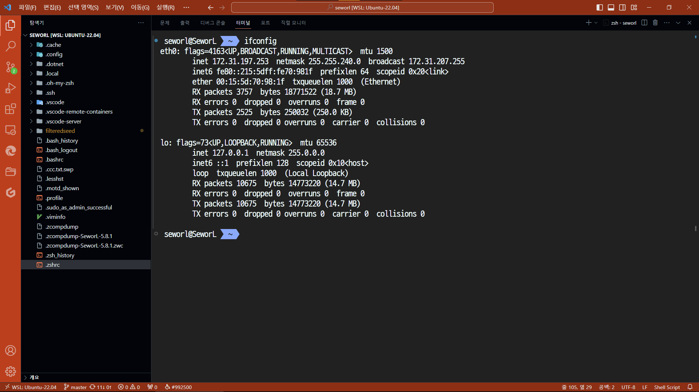
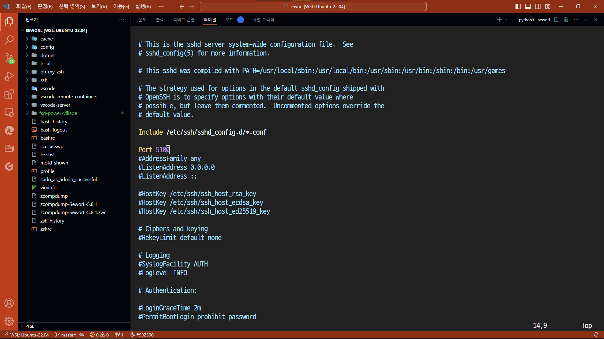
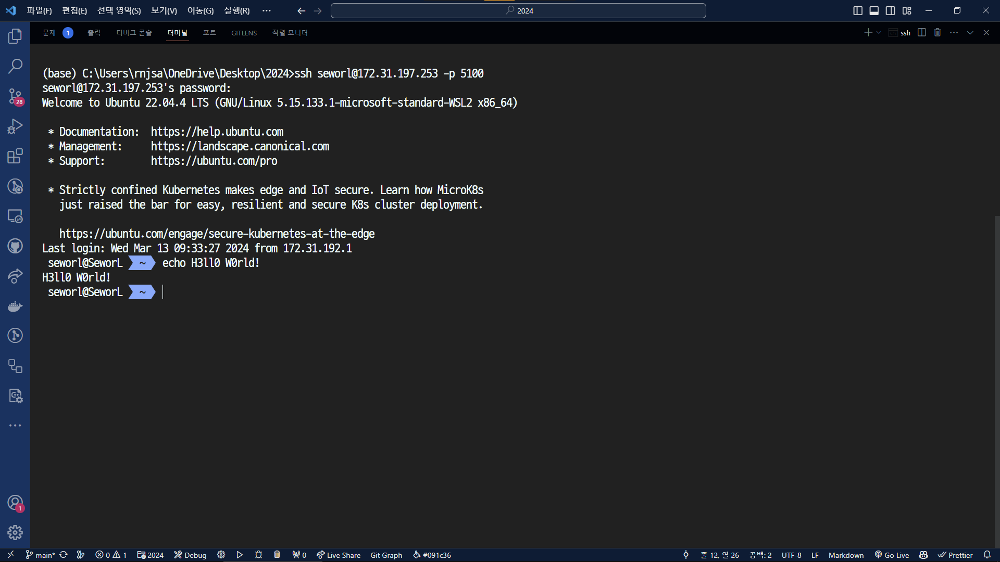
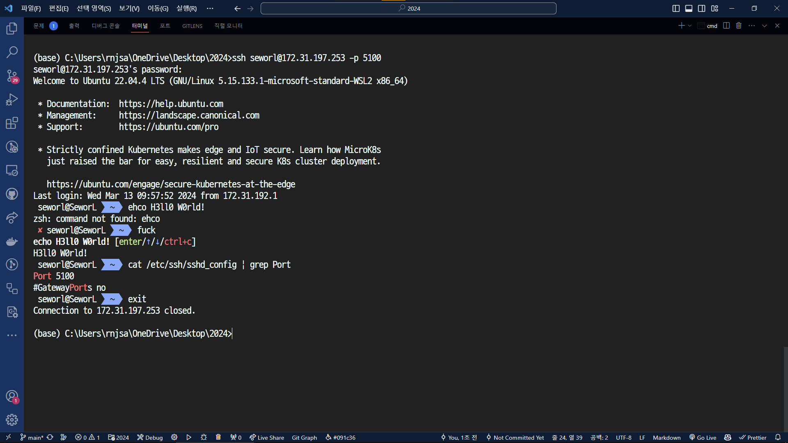
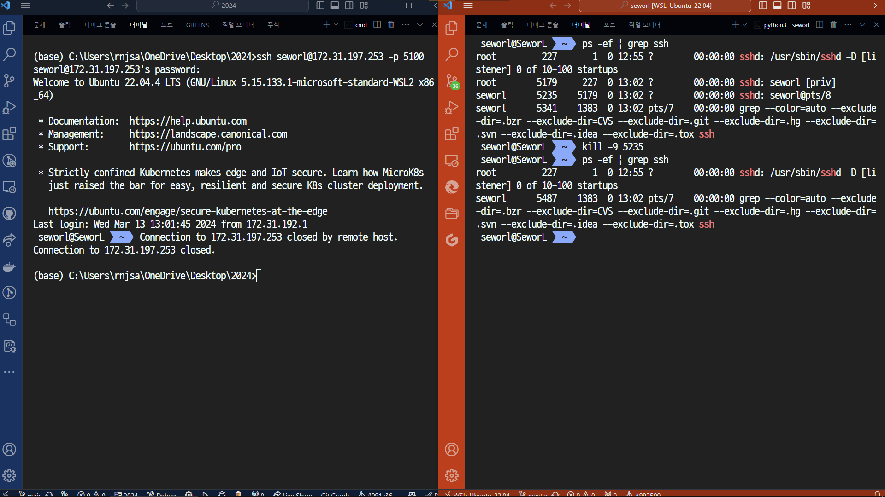

# Homework #1

School ID: 202355517 \
Name: 권민규

## Homework Problem 1

1. Install the ssh server on the Ubuntu (You don't have to submit your screen shot for this).
2. Find the Ubuntu's IP address using the Linux command, ifconfig.

3. Change your ssh server port 22 to 5100

4. Take a screen-capture of your putty, which is connecting the Ubuntu.

5. With some shell commands, show that the ssh server is running on the Ubuntu.

6. Run a new terminal and Kill the terminal where the ssh session (or connection) run172.31.197.253ning on the Ubuntu using "kill -9 processID" command.\
(if you want to do this, the following steps may be required.)

* Ubuntu와 putty 양쪽 모두 이미 사용하던 wsl과 vscode의 remote-ssh extension을 통해 동일한 결과를 얻을 수 있어 이를 사용했습니다.
* 노트북의 사양/연식 문제로 VM 사용이 어려워 양해 부탁드립니다.
* 문제가 있을 시 연락 부탁드립니다. 감사합니다.