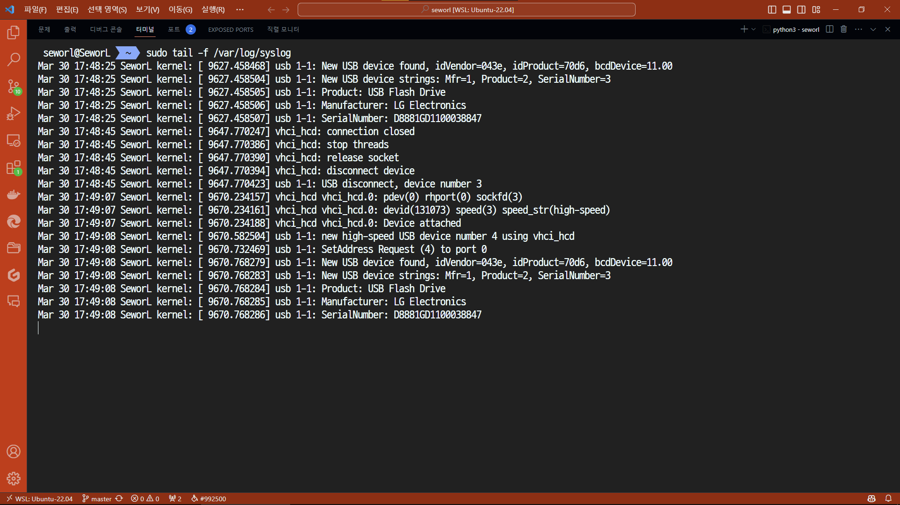
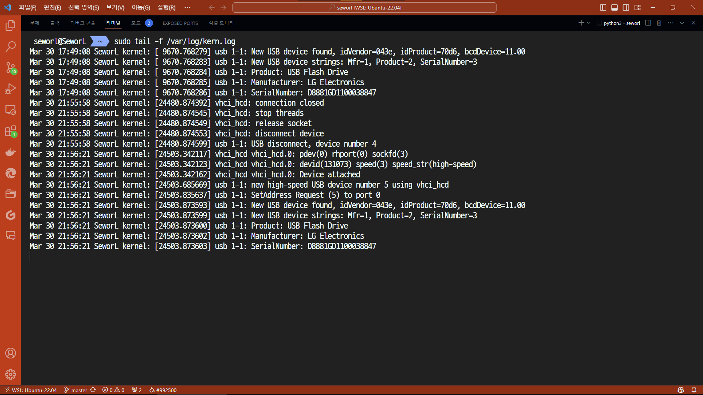

# Homework #3

School ID: 202355517
Name: 권민규

## 1. Plug your USB memory stick into your Linux Box and then monitor what happens on you system with `tail -f ....` command

우분투에서 usb 연결 시 이하의 파일 두 곳에 로그가 남는다고 한다.

- `/var/log/syslog`
- `/var/log/kern.log`

```bash
sudo tail -f /var/log/syslog
```

해당 명령어를 작동시켜놓은 채 USB를 연결하면 다음과 같은 로그가 남는다.

```bash
Mar 30 17:49:07 SeworL kernel: [ 9670.234157] vhci_hcd vhci_hcd.0: pdev(0) rhport(0) sockfd(3)
Mar 30 17:49:07 SeworL kernel: [ 9670.234161] vhci_hcd vhci_hcd.0: devid(131073) speed(3) speed_str(high-speed)
Mar 30 17:49:07 SeworL kernel: [ 9670.234188] vhci_hcd vhci_hcd.0: Device attached
Mar 30 17:49:08 SeworL kernel: [ 9670.582504] usb 1-1: new high-speed USB device number 4 using vhci_hcd
Mar 30 17:49:08 SeworL kernel: [ 9670.732469] usb 1-1: SetAddress Request (4) to port 0
Mar 30 17:49:08 SeworL kernel: [ 9670.768279] usb 1-1: New USB device found, idVendor=043e, idProduct=70d6, bcdDevice=11.00
Mar 30 17:49:08 SeworL kernel: [ 9670.768283] usb 1-1: New USB device strings: Mfr=1, Product=2, SerialNumber=3
Mar 30 17:49:08 SeworL kernel: [ 9670.768284] usb 1-1: Product: USB Flash Drive
Mar 30 17:49:08 SeworL kernel: [ 9670.768285] usb 1-1: Manufacturer: LG Electronics
Mar 30 17:49:08 SeworL kernel: [ 9670.768286] usb 1-1: SerialNumber: D8881GD1100038847
```



```bash
sudo tail -f /var/log/kern.log
```

```bash
Mar 30 21:56:21 SeworL kernel: [24503.342117] vhci_hcd vhci_hcd.0: pdev(0) rhport(0) sockfd(3)
Mar 30 21:56:21 SeworL kernel: [24503.342123] vhci_hcd vhci_hcd.0: devid(131073) speed(3) speed_str(high-speed)
Mar 30 21:56:21 SeworL kernel: [24503.342162] vhci_hcd vhci_hcd.0: Device attached
Mar 30 21:56:21 SeworL kernel: [24503.685669] usb 1-1: new high-speed USB device number 5 using vhci_hcd
Mar 30 21:56:21 SeworL kernel: [24503.835637] usb 1-1: SetAddress Request (5) to port 0
Mar 30 21:56:21 SeworL kernel: [24503.873593] usb 1-1: New USB device found, idVendor=043e, idProduct=70d6, bcdDevice=11.00
Mar 30 21:56:21 SeworL kernel: [24503.873599] usb 1-1: New USB device strings: Mfr=1, Product=2, SerialNumber=3
Mar 30 21:56:21 SeworL kernel: [24503.873600] usb 1-1: Product: USB Flash Drive
Mar 30 21:56:21 SeworL kernel: [24503.873602] usb 1-1: Manufacturer: LG Electronics
Mar 30 21:56:21 SeworL kernel: [24503.873603] usb 1-1: SerialNumber: D8881GD1100038847
```



> 본인은 wsl을 사용하기 때문에 USB를 연결하기 위해서 추가적인 작업을 해야할 필요가 있다. `usbipd-win`을 설치해 usb 드라이브와 wsl을 연결해야 하나, 이번 과제에서는 생략한다.

## 2. Do not unplug your USB memory, however, use the command `unmount` to unmount your USB memory file system on your Linux box - explain this procedure step.