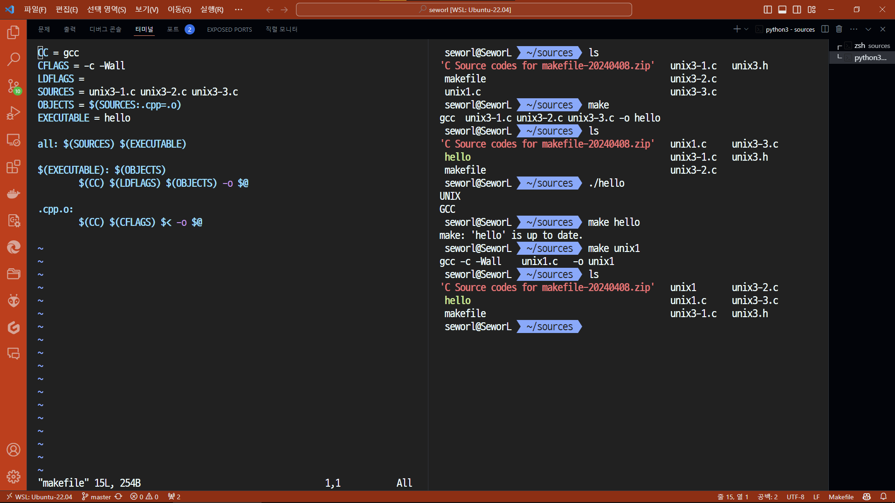

# Homework 4

School ID: 202355517
Name: 권민규

## The following shows one of basic makefiles using some macro symbols

```makefile
CC = g++
CFLAGS = -c -Wall
LDFLAGS =
SOURCES = main.cpp hello.cpp factorial.cpp
OBJECTS = $(SOURCES:.cpp=.o)
EXECUTABLE = hello

all: $(SOURCES) $(EXECUTABLE)

$(EXECUTABLE): $(OBJECTS)
  $(CC) $(LDFLAGS) $(OBJECTS) -o $@

.cpp.o:
  $(CC) $(CFLAGS) $< -o $@
```

1. Rewrite down the makefile shown in the lecture note addressing how to makefile and using `unix3-1.c`, `unix3-2.c`, `unix3-3.c`.\
`SOURCES = main.cpp hello.cpp factorial.cpp`를 `SOURCES = unix3-1.c unix3-2.c unix3-3.c`로 바꾼다.
2. Use gcc compiler.\
`CC = g++`를 `CC = gcc`로 바꾼다.
3. Your makefile should include macro symbos `$@` and `$<`.\
`$@`는 타겟 파일의 이름이다. 예를 들어`make hello`를 실행하면`$@`는 `hello`가 된다.\
`$<`는 의존 파일 중 첫 번째 파일의 이름이다. 예를 들어`make hello`를 실행하면`$<`는`main.cpp`가 된다.

### Outcome

