# 화이트해커를위한웹해킹의기술

## 웹 모의해킹 준비

### 버프 스위트

#### HTTP 프록시 개요

- HTTP 프록시: 클라이언트와 서버 사이에 위치하여 HTTP 트래픽을 중계하는 서버
  - 메세지 조회, 수정, 전달 취소 가능

#### 버프 스위트 설정

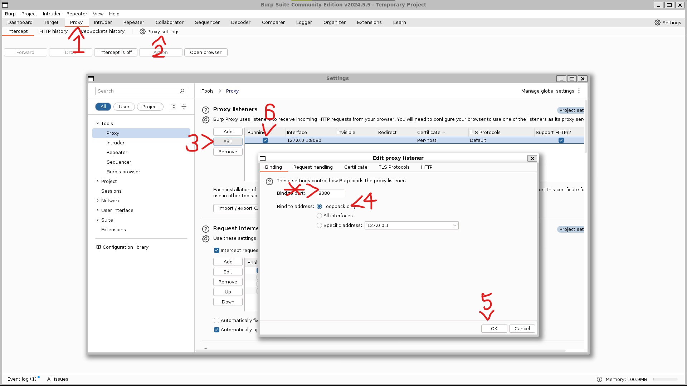

*: 필요 시 포트 변경
7: 체크 되어있는지 확인

#### 웹 브라우저 프록시 설정

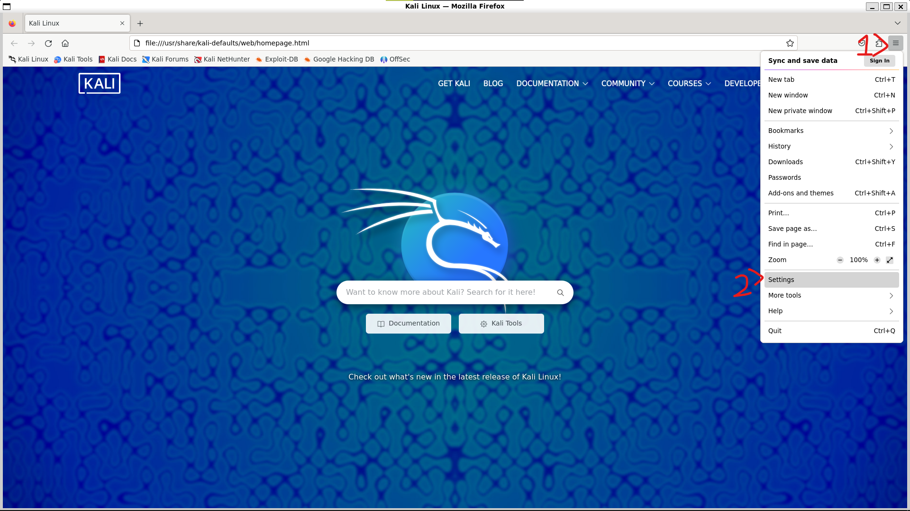
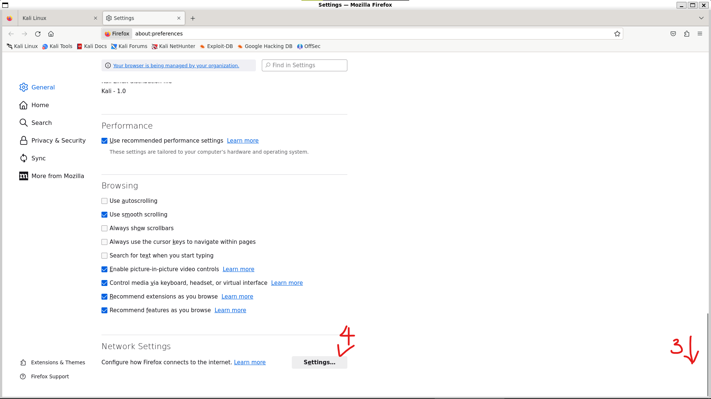
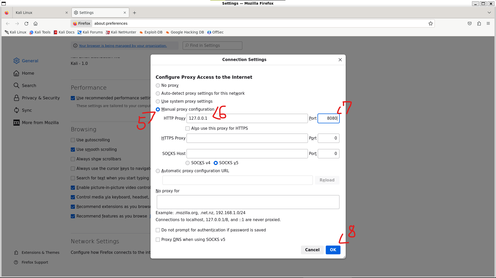

7: 버프 스위트에서 설정한 포트 입력

이제 버프 스위트를 사용하여 웹 트래픽을 가로챌 수 있음.
공격대상 가상머신에 접속하면 아래와 같은 인터셉트가 캡처됨.

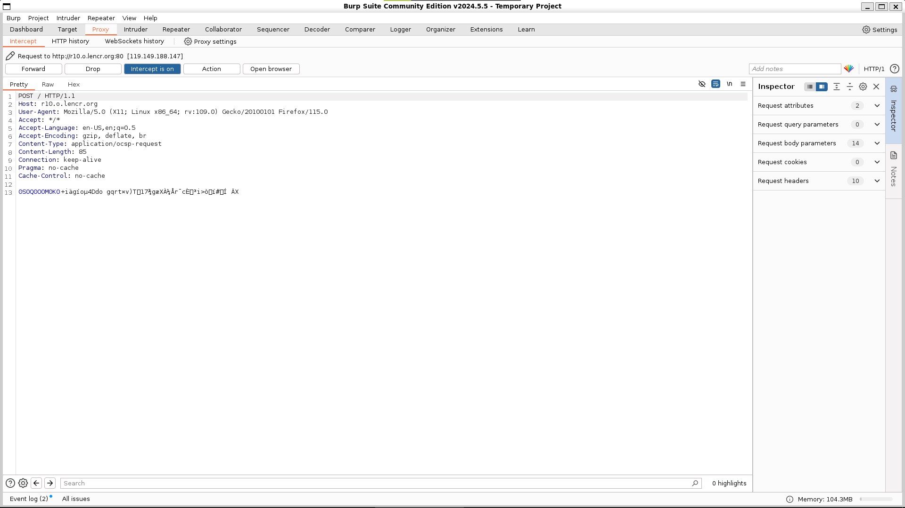

#### 폭시프록시(FoxyProxy) 애드온

- 웹 브라우저의 프록시 설정을 쉽게 변경할 수 있도록 도와주는 애드온

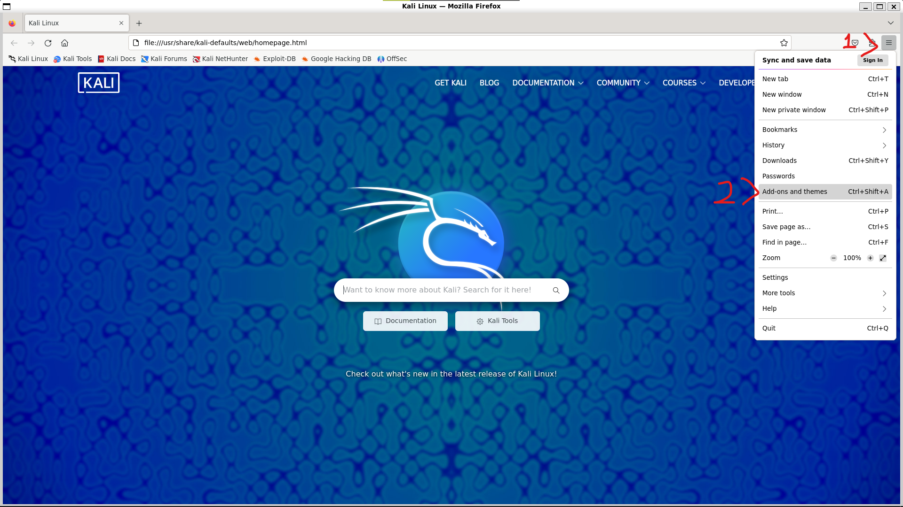
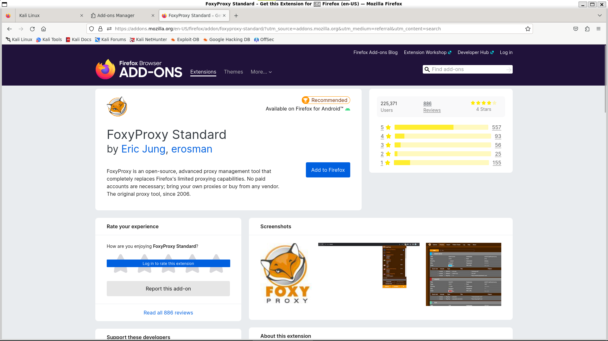
[FoxyProxy Standard](https://addons.mozilla.org/en-US/firefox/addon/foxyproxy-standard/?utm_source=addons.mozilla.org&utm_medium=referral&utm_content=search)

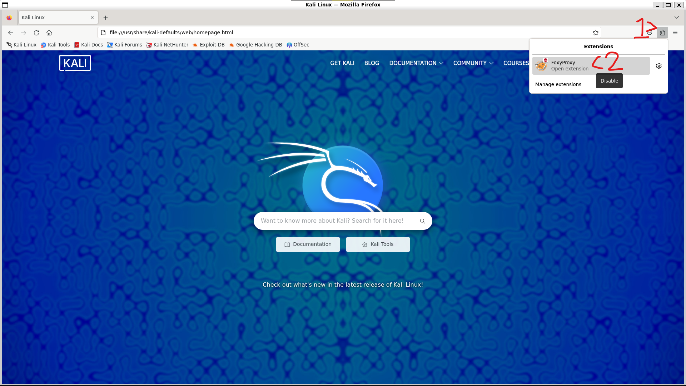
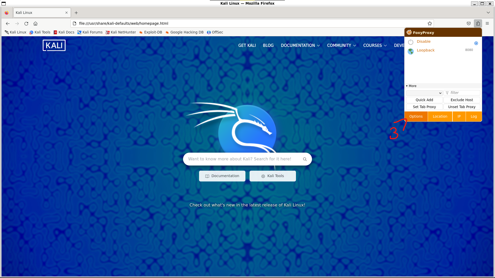
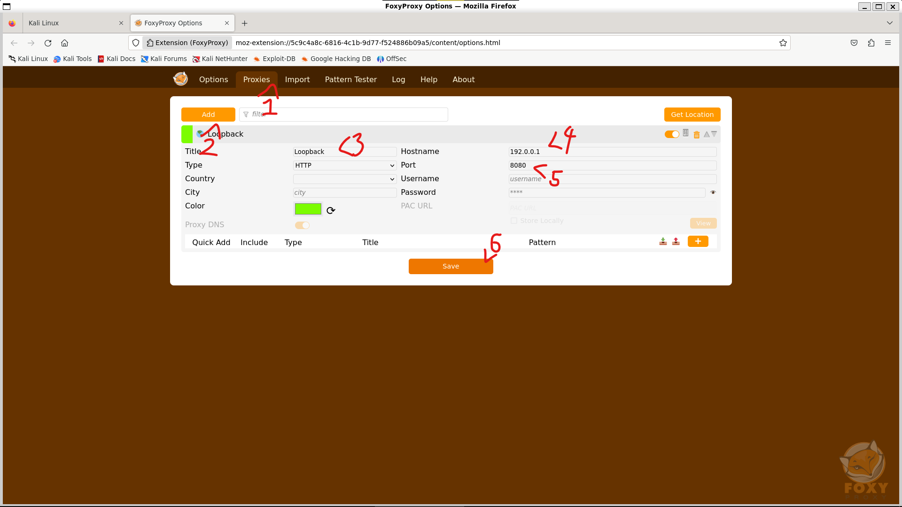

4: 잘못 작성했다. 127.0.0.1 입력

이제 필요에 따라 프록시 설정을 쉽게 변경할 수 있다.

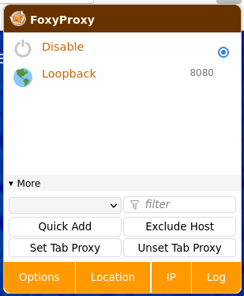

#### HTTPS 사이트 접속 문제

이 상태에서 HTTPS에 접속을 시도해도 접속되지 않을 것이다.

- 인증서 문제
  - 버프 스위트가 HTTPS 트래픽을 가로채기 위해 자체 인증서를 사용하고 있기 때문
  - 웹 브라우저가 버프 스위트의 인증서를 신뢰하지 않기 때문에 접속이 차단됨

해결 방법은 인증서를 신뢰할 수 있도록 설정하는 것이다.
아래 방법을 따르자.

[burp](http://burp)로 접속

cacert.der 다운로드 확인

브라우저 설정으로 이동한다.

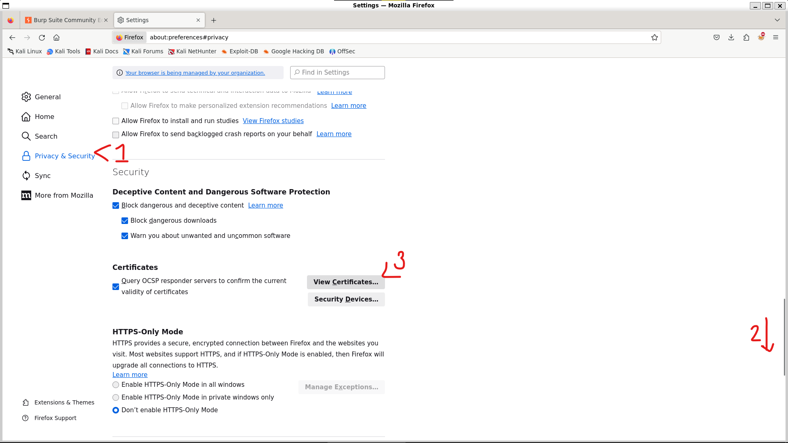
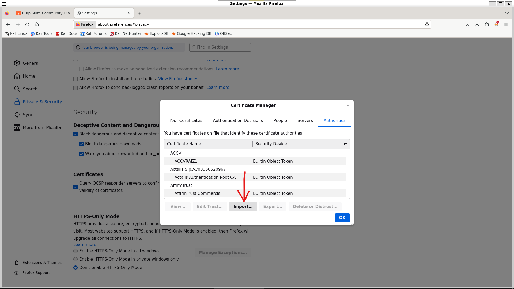
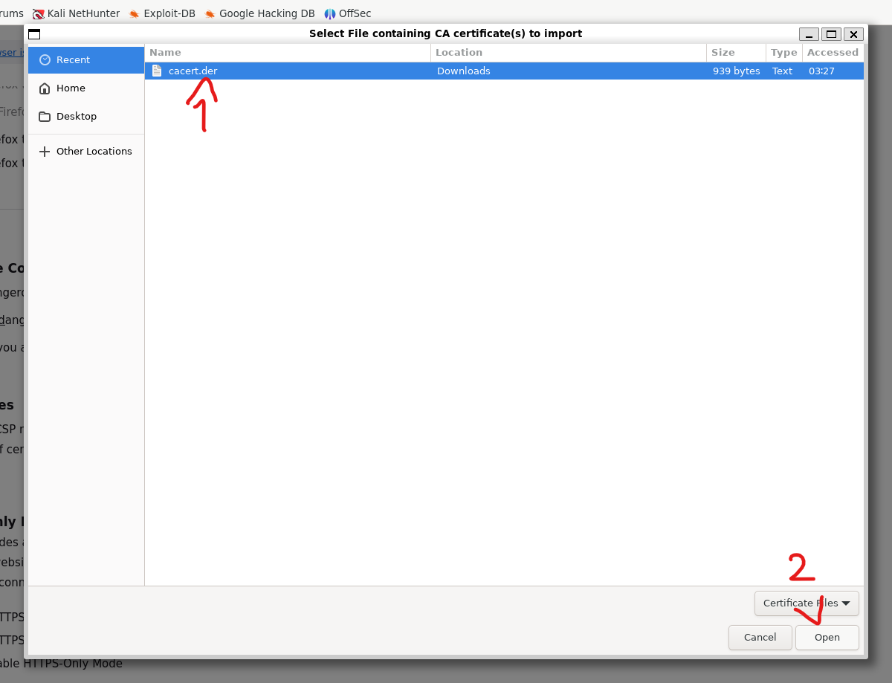
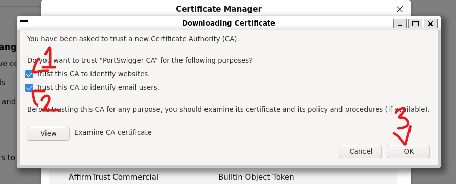

#### 버프 스위트의 기능

- 타깃(Target)
  - 사이트 맵(Site Map): 타깃의 구조를 시각적으로 표현
  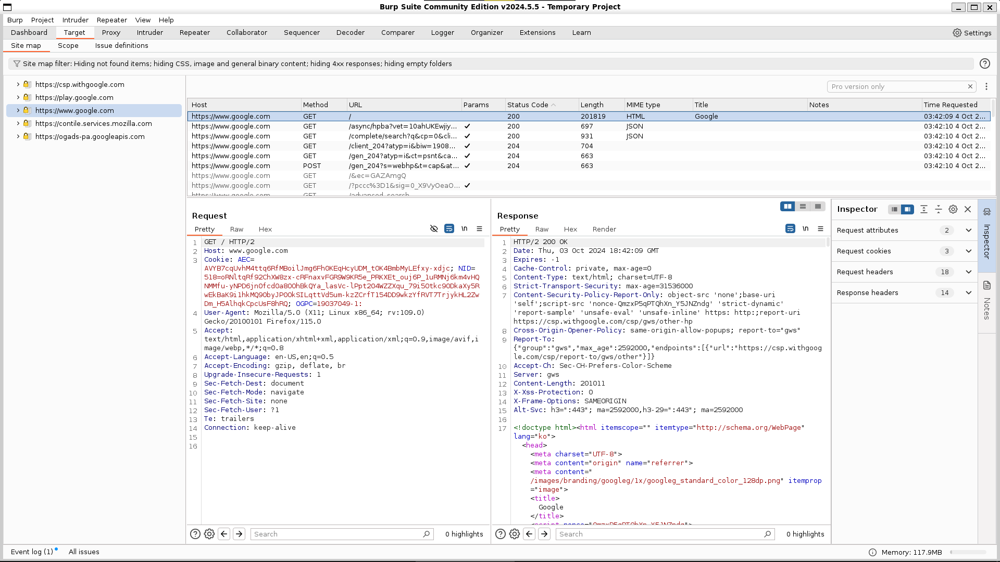
  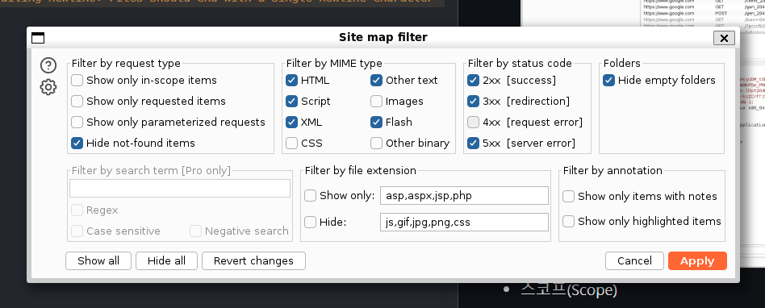
  - 스코프(Scope): 타깃의 범위를 설정
  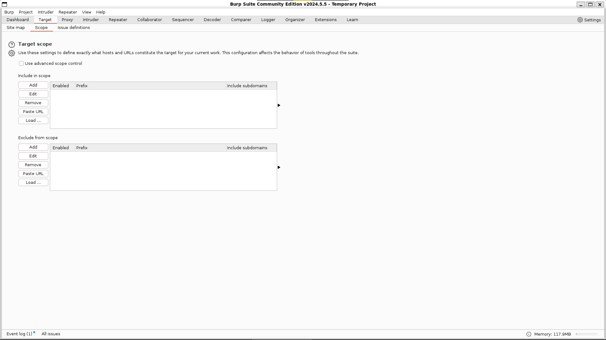
- 프록시(Proxy)
  - 인터셉트(Intercept): HTTP 요청을 가로챔
  - 히스토리(History): 가로챈 HTTP 요청을 확인
  - 옵션(Options): 프록시 설정
- 스파이더(Spider)
  - 사이트 구조를 분석하여 사이트 맵에 추가
  - 최신 버전의 Burp Suite에서는 Scan이라는 이름의 유료 기능으로 전환되었다.
  - !!!비상비상초비상!!!
- 인트루더(Intruder)
  - 웹 어플리케이션의 취약점을 찾기 위한 도구
  - 페이로드를 여러 번 반복하여 서버의 응답을 분석: 퍼징(fuzzing)
  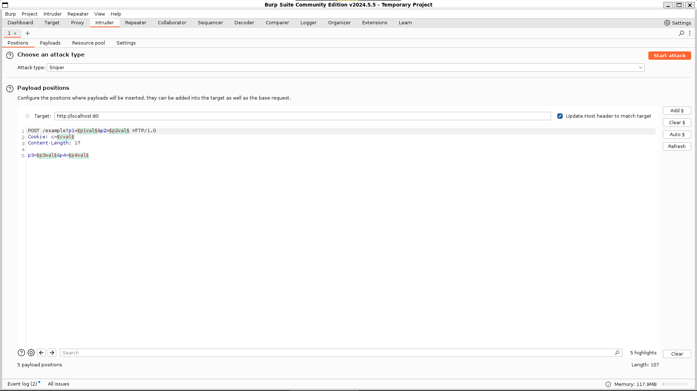
- 리피터(Repeater)
  - 서버에 요청을 반복하여 보내는 도구
  - 인트루더와 달리 자동화된 퍼징을 지원하지 않음
- 기타
  - 스캐너(Scanner): 자동으로 취약점을 찾는 도구(유료)
  - 시퀀서(Sequencer): 난수 생성기, 세션 토큰 분석
  - 디코더(Decoder): URL, HTML, Base64 등의 인코딩을 디코딩
  - 컴페어러(Comparer): 두 요청을 비교
  - 익스텐더(Extender): 사용자 정의 기능 추가