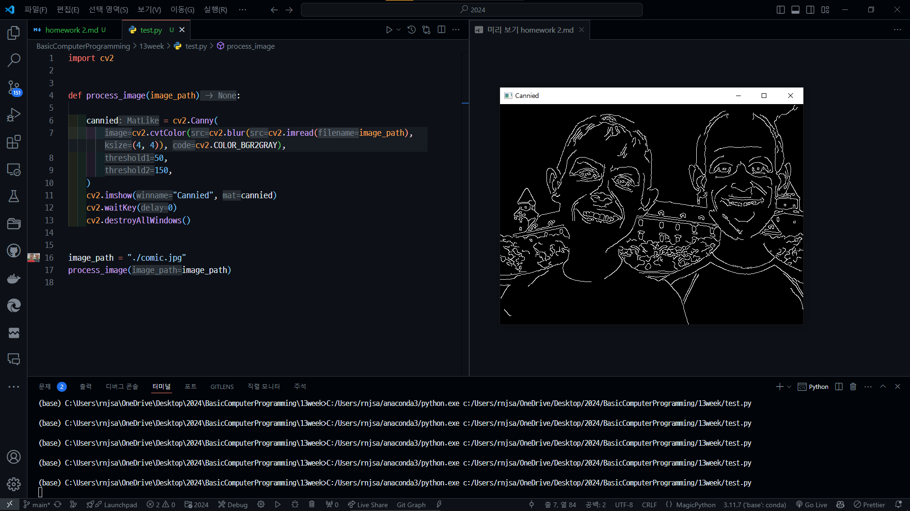

# Report 2

분반: 105

학과: 컴퓨터공학과 컴퓨터공학전공\
학번: 202355517\
이름: 권민규

```python
import cv2


def process_image(image_path):

    cannied = cv2.Canny(
        cv2.cvtColor(cv2.blur(cv2.imread(image_path), (4, 4)), cv2.COLOR_BGR2GRAY),
        50,
        150,
    )
    cv2.imshow("Cannied", cannied)
    cv2.waitKey(0)
    cv2.destroyAllWindows()


image_path = "./comic.jpg"
process_image(image_path)
```
