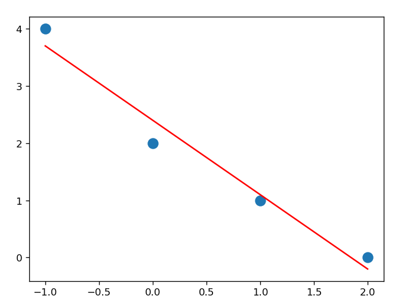

# 공학선형대수학 Homework 5

## 1

### Problem

직선 $y = 2x + 1$ 위에서 점 $\left(5, 2\right)$와 가장 가까운 점을 구하라.

### Solution

$y = 2x$ 위의 벡터 $\bold{v} = \left(1, 2\right)^T$와
$\bold{w} = \left(5, 1\right)^T$에 대하여

$Q = \dfrac{\bold{w^T} \bold{v}}{\bold{v^T} \bold{v}}\bold{v} = \dfrac{7}{5}\left(1, 2\right) = \left(\dfrac{7}{5}, \dfrac{14}{5}\right)^T$

따라서 $\left(\dfrac{7}{5}, \dfrac{14}{5}+1\right) = \underline{\left(1.4, 3.8\right)}$이다.

## 2

### Problem

점 $\left(1, 1, 1\right)$과 평면 $2x + 2y + z = 0$ 사이의 거리를 구하라.

### Solution

$\dfrac{\left|2 \cdot 1 + 2 \cdot 1 + 1\right|}{\sqrt{2^2 + 2^2 + 1^2}} = \underline{\dfrac{5}{3}}$이다.

## 3

### Problem

점 $\left(2, -3, 4\right)$와 다음 평면과의 거리를 구하라.

$$
8\left(x-2\right) + 6\left(y+2\right) - \left(z-4\right) = 0
$$

### Solution

$\dfrac{\left|8\left(2-2\right) + 6\left(-3+2\right) - \left(4-4\right)\right|}{\sqrt{8^2 + 6^2 + 1^2}} = \underline{\dfrac{6}{\sqrt{101}}}$이다.

## 4

### Problem

다음 각각의 행렬에 대하여 부분공간 $R\left(A^T\right), N\left(A\right),  R\left(A\right), N\left(A^T\right)$의 기저를 구하라.

#### (1)

$$
A = \begin{bmatrix} 2 & 4 \\ -4 & -8 \end{bmatrix}
$$

#### Solution

$R\left(A^T\right)$의 기저는 $\underline{\left(1, -2\right)^T}$이다.

$A = \begin{bmatrix} 2 & 4 \\ -4 & -8 \end{bmatrix} = 2\begin{bmatrix} 1 & 2 \\ -2 & -4 \end{bmatrix} = 2\begin{bmatrix} 1 & 2 \\ 0 & 0 \end{bmatrix}$에서 $N\left(A\right)$의 기저는 $\underline{\left(2, -1\right)^T}$이다.

$R\left(A\right)$의 기저는 $\underline{\left(1, 2\right)^T}$이다.

$A^T = \begin{bmatrix} 2 & -4 \\ 4 & -8 \end{bmatrix} = 2\begin{bmatrix} 1 & -2 \\ 2 & -4 \end{bmatrix} = 2\begin{bmatrix} 1 & -2 \\ 0 & 0 \end{bmatrix}$에서 $N\left(A^T\right)$의 기저는 $\underline{\left(2, 1\right)^T}$이다.

#### (2)

$$
A = \begin{bmatrix} 1 & 4 & 2 \\ 3 & 1 & 6 \end{bmatrix}
$$

#### Solution

$R\left(A^T\right)$의 기저는 $\underline{\left(1, 3\right)^T, \left(4, 1\right)^T}$이다.

$A = \begin{bmatrix} 1 & 4 & 2 \\ 3 & 1 & 6 \end{bmatrix} = \begin{bmatrix} 1 & 4 & 2 \\ 0 & -11 & 0 \end{bmatrix} = \begin{bmatrix} 1 & 0 & 2 \\ 0 & 1 & 0 \end{bmatrix}$에서 $N\left(A\right)$의 기저는 $\underline{\left(-2, 0, 1\right)^T, \left(0, 1, 0\right)^T}$이다.

$R\left(A\right)$의 기저는 $\underline{\left(1, 4, 2\right)^T, \left(3, 1, 6\right)^T}$이다.

$A^T = \begin{bmatrix} 1 & 3 \\ 4 & 1 \\ 2 & 6 \end{bmatrix} = \begin{bmatrix} 1 & 3 \\ 0 & -11 \\ 0 & 0 \end{bmatrix} = \begin{bmatrix} 1 & 0 \\ 0 & 1 \end{bmatrix}$에서 $N\left(A^T\right)$의 기저는 $\underline{\left(1, 1\right)^T, \left(0, 1\right)^T}$이다.

#### (3)

$$
A = \begin{bmatrix} 4 & 2 \\ -2 & 3 \\ 1 & 4 \\ 5 & 1 \end{bmatrix}
$$

#### Solution

$R\left(A^T\right)$의 기저는 $\underline{\left(4, -2, 1, 5\right)^T, \left(2, 3, 4, 1\right)^T}$이다.

$A = \begin{bmatrix} 4 & 2 \\ -2 & 3 \\ 1 & 4 \\ 5 & 1 \end{bmatrix} = \begin{bmatrix} 1 & 0 \\ 0 & 1 \\ 0 & 0 \\ 0 & 0 \end{bmatrix}$에서 $N\left(A\right)$의 기저는 $\underline{\left(1, 0\right)^T, \left(0, 1\right)^T}$이다.

$R\left(A\right)$의 기저는 $\underline{\left(4, 2\right)^T, \left(-2, 3\right)^T, \left(1, 4\right)^T, \left(5, 1\right)^T}$이다.

$A^T = \begin{bmatrix} 4 & -2 & 1 & 5 \\ 2 & 3 & 4 & 1 \end{bmatrix} = \begin{bmatrix} 16 & 0 & 13 & 17 \\ 0 & 8 & 7 & -3 \end{bmatrix} = \begin{bmatrix} 1 & 0 & \dfrac{13}{16} & \dfrac{17}{16} \\ 0 & 1 & \dfrac{7}{8} & -\dfrac{3}{8} \end{bmatrix}$에서 $N\left(A^T\right)$의 기저는 $\underline{\left(-\dfrac{13}{16}, -\dfrac{7}{8}, 1, 0\right)^T, \left(-\dfrac{17}{16}, \dfrac{3}{8}, 0, 1\right)^T}$이다.

#### (4)

$$
A = \begin{bmatrix} 1 & 0 & 1 & 0 \\ 0 & 0 & 4 & 4 \\ 2 & 2 & 0 & 1 \\ 2 & 1 & 1 & 1\end{bmatrix}
$$

#### Solution

$R\left(A^T\right)$의 기저는 $\underline{\left(1, 0, 2, 2\right)^T, \left(0, 0, 2, 1\right)^T, \left(1, 4, 0, 1\right)^T}$이다.

$A = \begin{bmatrix} 1 & 0 & 1 & 0 \\ 0 & 0 & 4 & 4 \\ 2 & 2 & 0 & 1 \\ 2 & 1 & 1 & 1\end{bmatrix} = \begin{bmatrix} 1 & 0 & 1 & 0 \\ 0 & 0 & 4 & 4 \\ 0 & 2 & -2 & 1 \\ 0 & 1 & -1 & 1\end{bmatrix} = \begin{bmatrix} 1 & 0 & 1 & 0 \\ 0 & 1 & -1 & 1 \\ 0 & 0 & 2 & 2 \\ 0 & 0 & 3 & 3\end{bmatrix} = \begin{bmatrix} 1 & 0 & 0 & 0 \\ 0 & 1 & 0 & 0 \\ 0 & 0 & 1 & 1 \\ 0 & 0 & 0 & 0\end{bmatrix}$에서 $N\left(A\right)$의 기저는 $\underline{\left(1, 0, 0, 0\right)^T, \left(0, 1, 0, 0\right)^T, \left(0, 0, 1, 1\right)^T}$이다.

$R\left(A\right)$의 기저는 $\underline{\left(1, 0, 1, 0\right)^T, \left(0, 0, 1, 1\right)^T, \left(2, 2, 0, 1\right)^T}$이다.

$A^T = \begin{bmatrix} 1 & 0 & 2 & 2 \\ 0 & 0 & 2 & 1 \\ 1 & 4 & 0 & 1 \\ 0 & 4 & 1 & 1\end{bmatrix} = \begin{bmatrix} 1 & 0 & 2 & 2 \\ 0 & 0 & 2 & 1 \\ 0 & 4 & -2 & -1 \\ 0 & 4 & -1 & -1\end{bmatrix} = \begin{bmatrix} 1 & 0 & 0 & 1 \\ 0 & 1 & 0 & -1 \\ 0 & 0 & 1 & 1 \\ 0 & 0 & 0 & 0\end{bmatrix}$에서 $N\left(A^T\right)$의 기저는 $\underline{\left(-1, 1, -1, 1\right)^T}$이다.

## 5

### Problem

다음의 연립방정식 $Ax = b$에 대해서 모든 최소제곱 해를 구하라.

#### (1)

$$
A = \begin{bmatrix}3 & -6 \\ 2 & -4 \\ -3 & 6 \end{bmatrix}, b = \begin{bmatrix} 3 \\ 1 \\ 0 \end{bmatrix}
$$

#### Solution

$A^TA = \begin{bmatrix} 22 & -44 \\ -44 & 88 \end{bmatrix}$, $A^Tb = \begin{bmatrix} -6 \\ 12 \end{bmatrix}$이므로

$A^TAx = A^Tb$를 풀면 $x = \underline{\begin{bmatrix} 0 \\ \dfrac{1}{2} \end{bmatrix}}$이다.

#### (2)

$$
A = \begin{bmatrix} 1 & 3 & -1 \\ 2 & 1 & 1 \\ 2 & 6 & -2 \end{bmatrix}, b = \begin{bmatrix} 0 \\ 0 \\ 0 \end{bmatrix}
$$

#### Solution

$A^TA = \begin{bmatrix} 9 & 21 & -9 \\ 21 & 46 & -18 \\ -9 & -18 & 6 \end{bmatrix}$, $A^Tb = \begin{bmatrix} 0 \\ 0 \\ 0 \end{bmatrix}$이므로

$A^TAx = A^Tb$를 풀면 $x = \underline{\begin{bmatrix} 0 \\ 0 \\ 0 \end{bmatrix}}$이다.

## 6

### Problem

#### (1)

다음과 같은 데이터에 대하여 직선으로 만든 최적의 최소제곱 추정을 구하라.

| $x$ | $-1$ | $0$ | $1$ | $2$ |
| --- | ---- | --- | --- | --- |
| $y$ | $4$  | $2$ | $1$ | $0$ |

#### Solution

$A = \begin{bmatrix} -1 & 1 \\ 0 & 1 \\ 1 & 1 \\ 2 & 1 \end{bmatrix}$, $b = \begin{bmatrix} 4 \\ 2 \\ 1 \\ 0 \end{bmatrix}$이므로

$A^TA = \begin{bmatrix} 6 & 2 \\ 2 & 4 \end{bmatrix}$, $A^Tb = \begin{bmatrix} -3 \\ 7 \end{bmatrix}$이다.

$A^TAx = A^Tb$를 풀면 $x = \begin{bmatrix} -1.3 \\ 2.4 \end{bmatrix}$이다.

따라서 $\underline{y = -1.3x + 2.4}$이다.

#### (2)

좌표 평면 위에 위의 데이터 점을 표시하고 (1)에서 구한 직선을 그려라.

#### Solution

## 7

### Problem

$\bold{x} = \left(-1, -1, 1, 1\right)^T$이고 $\bold{y} = \left(1, 1, 5, -3\right)^T$이다. $\bold{x} \perp \bold{y}$임을 증명하라. $||\bold{x}||_2$, $||\bold{y}||_2$, $||\bold{x} + \bold{y}||_2$를 계산하고, 피타고라스 법칙이 성립하는지 확인하라.

### Solution

$\bold{x} \perp \bold{y}$임을 증명하려면 $\bold{x}^T\bold{y} = 0$임을 보이면 된다.

$\bold{x}^T\bold{y} = \begin{bmatrix} -1 & -1 & 1 & 1 \end{bmatrix}\begin{bmatrix} 1 \\ 1 \\ 5 \\ -3 \end{bmatrix} = -1 - 1 + 5 - 3 = 0$이므로 $\bold{x} \perp \bold{y}$이다.

$||\bold{x}||_2 = \sqrt{(-1)^2 + (-1)^2 + 1^2 + 1^2} = 2$, $||\bold{y}||_2 = \sqrt{1^2 + 1^2 + 5^2 + (-3)^2} = \sqrt{36} = 6$, $||\bold{x} + \bold{y}||_2 = \sqrt{0^2 + 0^2 + 6^2 + (-2)^2} = \sqrt{40} = 2\sqrt{10}$이다.

따라서 $||\bold{x}||_2^2 + ||\bold{y}||_2^2 = ||\bold{x} + \bold{y}||_2^2$이 성립한다.

## 8

### Problem

$\bold{x} = \left(2, 3, 1\right)^T$이고 $\bold{y} = \left(5, 6, 2\right)^T$이다. $||\bold{x} - \bold{y}||_1$, $||\bold{x} - \bold{y}||_2$, $||\bold{x} - \bold{y}||_\infty$를 구하라. $\bold{x}$와 $\bold{y}$의 거리가 가장 가깝다는 결과를 주는 노움은 무엇인가? 가장 멀다는 결과를 주는 노움은 무엇인가?

### Solution

$||\bold{x} - \bold{y}||_1 = |2-5| + |3-6| + |1-2| = 3 + 3 + 1 = \underline{7}$\
$||\bold{x} - \bold{y}||_2 = \sqrt{(2-5)^2 + (3-6)^2 + (1-2)^2} = \sqrt{9 + 9 + 1} = \underline{\sqrt{19}}$\
$||\bold{x} - \bold{y}||_\infty = \max\{|2-5|, |3-6|, |1-2|\} = \underline{3}$이다.

따라서 가장 가깝다는 결과를 주는 노움은 $\underline{||\bold{x} - \bold{y}||_\infty}$이고, 가장 멀다는 결과를 주는 노움은 $\underline{||\bold{x} - \bold{y}||_2}$이다.

## 9

### Problem

집합 $\{\bold{u}_1, \bold{u}_2, \bold{u}_3\}$를 내적공간 $V$의 정규직교 기저라 하고 다음을 생각하자.

$$
\bold{u} = \bold{u}_1 + 2\bold{u}_2 + 2\bold{u}_3 \quad \bold{v} = \bold{u}_1 + 7\bold{u}_3
$$

다음 각각의 값을 구하라.

#### (1)

$$
\left<\bold{u}, \bold{v}\right>
$$

#### Solution

$\left<\bold{u}, \bold{v}\right> = \bold{u}\bold{v}\cos\theta = \underline{15}$

#### (2)

$$
||\bold{u}||, ||\bold{v}||
$$

#### Solution

$||\bold{u}|| = \sqrt{1^2 + 2^2 + 2^2} = \underline{3}$\
$||\bold{v}|| = \sqrt{1^2 + 7^2}  = \underline{5\sqrt{2}}$

#### (3)

$$
\theta
$$

#### Solution

$\cos\theta = \dfrac{\left<\bold{u}, \bold{v}\right>}{||\bold{u}|| \cdot ||\bold{v}||} = \dfrac{15}{3 \cdot 5\sqrt{2}} = \dfrac{1}{\sqrt{2}}$이므로 $\theta = \underline{\dfrac{\pi}{4}}$이다.

## 10

### Problem

$\mathbb{R}^3$의 기저 $\left(1, 2, -2\right)^T, \left(4, 3, 2\right)^T, \left(1, 2, 1\right)^T$가 주어졌다. 그람-슈미트 과정을 적용하여 정규직교 기저를 구하라.

### Solution

$\bold{u}_1 = \left(1, 2, -2\right)^T$로 두고, $\bold{u}_2 = \left(4, 3, 2\right)^T$, $\bold{u}_3 = \left(1, 2, 1\right)^T$에 대하여

$\bold{v}_2 = \bold{u}_2 - \dfrac{\left<\bold{u}_2, \bold{v}_1\right>}{\left<\bold{v}_1, \bold{v}_1\right>}\bold{v}_1 = \left(4, 3, 2\right)^T - \dfrac{11}{9}\left(1, 2, -2\right)^T = \left(\dfrac{5}{3}, -\dfrac{1}{3}, \dfrac{25}{3}\right)^T$

$\bold{v}_3 = \bold{u}_3 - \dfrac{\left<\bold{u}_3, \bold{v}_1\right>}{\left<\bold{v}_1, \bold{v}_1\right>}\bold{v}_1 - \dfrac{\left<\bold{u}_3, \bold{v}_2\right>}{\left<\bold{v}_2, \bold{v}_2\right>}\bold{v}_2 = \left(1, 2, 1\right)^T - \dfrac{11}{9}\left(1, 2, -2\right)^T - \dfrac{11}{9}\left(\dfrac{5}{3}, -\dfrac{1}{3}, \dfrac{25}{3}\right)^T = \left(-\dfrac{1}{3}, \dfrac{2}{3}, \dfrac{2}{3}\right)^T$

따라서 정규직교 기저는 $\underline{\left(\dfrac{1}{3}, \dfrac{2}{3}, -\dfrac{2}{3}\right)^T, \left(\dfrac{5}{3}, -\dfrac{1}{3}, \dfrac{5}{3}\right)^T, \left(-\dfrac{1}{3}, \dfrac{2}{3}, \dfrac{2}{3}\right)^T}$이다.
