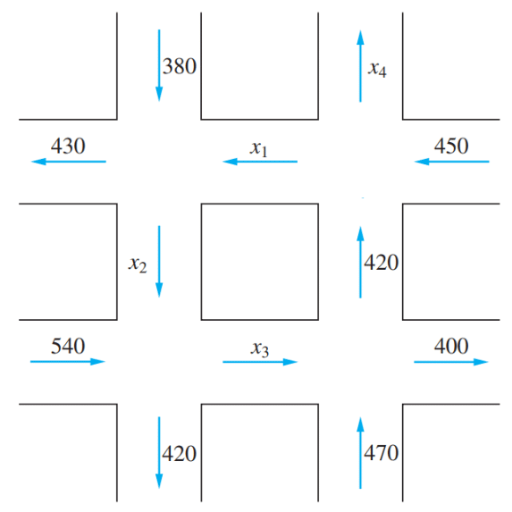
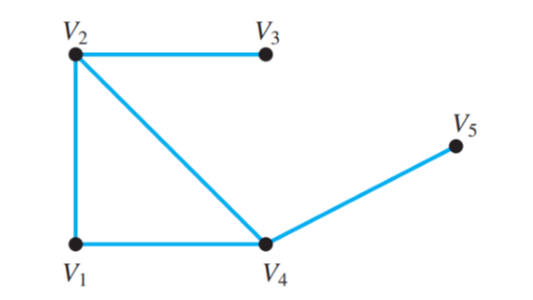

# Homework - Chapter 1

학번: 202355517
이름: 권민규

## 1.1

### 1

다음과 같은 각 방정식들의 시스템을 풀기 위하여 역방향 대입을 사용하라.

#### (a)

$$\begin{aligned}
    x_1 + x_2 = 7 \\
    2x_2 = 6
  \end{aligned}$$

$\begin{bmatrix} 1 & 1 & 7 \\ 0 & 2 & 6 \end{bmatrix}$

$\Rightarrow \begin{bmatrix} 1 & 1 & 7 \\ 0 & 1 & 3 \end{bmatrix}$

$\Rightarrow \begin{bmatrix} 1 & 0 & 4 \\ 0 & 1 & 3 \end{bmatrix}$

$\therefore x_1 = 4, x_2 = 3$

#### (b)

$$\begin{aligned}
    x_1 + x_2 + x_3 = 10\\
    2x_2 + x_3 = 11\\
    2x_3 = 14
  \end{aligned}$$

$\begin{bmatrix} 1 & 1 & 1 & 10 \\ 0 & 2 & 1 & 11 \\ 0 & 0 & 2 & 14 \end{bmatrix}$

$\Rightarrow \begin{bmatrix} 1 & 1 & 1 & 10 \\ 0 & 2 & 1 & 11 \\ 0 & 0 & 1 & 7 \end{bmatrix}$

$\Rightarrow \begin{bmatrix} 1 & 1 & 0 & 3 \\ 0 & 1 & 0 & 2 \\ 0 & 0 & 1 & 7 \end{bmatrix}$

$\Rightarrow \begin{bmatrix} 1 & 0 & 0 & 1 \\ 0 & 1 & 0 & 2 \\ 0 & 0 & 1 & 7 \end{bmatrix}$

$\therefore x_1 = 1, x_2 = 2, x_3 = 7$

#### (c)

$$\begin{aligned}
    x_1 + 2x_2 + 3x_3 + 4x_4 &= 6\\
    7x_2 - x_3 + 2x_4 &= 5\\
    x_3 - 4x_4 &= -9\\
    4x_4 &= 8
  \end{aligned}$$

$\left[\begin{array}{cccc|c} 1 & 2 & 3 & 4 & 6 \\ 0 & 7 & -1 & 2 & 5 \\ 0 & 0 & 1 & -4 & -9 \\ 0 & 0 & 0 & 4 & 8 \end{array}\right]$

$\Rightarrow \left[\begin{array}{cccc|c} 1 & 2 & 3 & 4 & 6 \\ 0 & 7 & -1 & 2 & 5 \\ 0 & 0 & 1 & -4 & -9 \\ 0 & 0 & 0 & 1 & 2 \end{array}\right]$

$\Rightarrow \left[\begin{array}{cccc|c} 1 & 2 & 3 & 0 & -2 \\ 0 & 7 & -1 & 0 & 1 \\ 0 & 0 & 1 & 0 & -1 \\ 0 & 0 & 0 & 1 & 2 \end{array}\right]$

$\Rightarrow \left[\begin{array}{cccc|c} 1 & 2 & 0 & 0 & 1 \\ 0 & 7 & 0 & 0 & 0 \\ 0 & 0 & 1 & 0 & -1 \\ 0 & 0 & 0 & 1 & 2 \end{array}\right]$

$\therefore x_1 = 1, x_2 = 0, x_3 = -1, x_4 = 2$

#### (d)

$$\begin{aligned}
    x_1 + x_2 + 16x_3 + 3x_4 + x_5 &= 5\\
    4x_2 + 4x_3 + 6x_4 + 3x_5 &= 1\\
    -8x_3 + 27x_4 - 7x_5 &= 7\\
    3x_4 + 11x_5 &= 1\\
    x_5 &= 0
  \end{aligned}$$

$\left[\begin{array}{ccccc|c}
  1 & 1 & 16 & 3 & 1 & 5 \\
  0 & 4 & 4 & 6 & 3 & 1 \\
  0 & 0 & -8 & 27 & -7 & 7 \\
  0 & 0 & 0 & 3 & 11 & 1 \\
  0 & 0 & 0 & 0 & 1 & 0
\end{array}\right]$

$\Rightarrow \left[\begin{array}{ccccc|c}
  1 & 1 & 16 & 3 & 0 & 5 \\
  0 & 4 & 4 & 6 & 0 & 1 \\
  0 & 0 & -8 & 27 & 0 & 7 \\
  0 & 0 & 0 & 3 & 0 & 1 \\
  0 & 0 & 0 & 0 & 1 & 0
\end{array}\right]$

$\Rightarrow \left[\begin{array}{ccccc|c}
  1 & 1 & 16 & 0 & 0 & 4 \\
  0 & 4 & 4 & 0 & 0 & -1 \\
  0 & 0 & -8 & 0 & 0 & -2 \\
  0 & 0 & 0 & 3 & 0 & 1 \\
  0 & 0 & 0 & 0 & 1 & 0
\end{array}\right]$

$\Rightarrow \left[\begin{array}{ccccc|c}
  1 & 1 & 0 & 0 & 0 & 0 \\
  0 & 4 & 0 & 0 & 0 & -2 \\
  0 & 0 & -4 & 0 & 0 & -1 \\
  0 & 0 & 0 & 3 & 0 & 1 \\
  0 & 0 & 0 & 0 & 1 & 0
\end{array}\right]$

$\Rightarrow \left[\begin{array}{ccccc|c}
  1 & 0 & 0 & 0 & 0 & \dfrac12 \\
  0 & 2 & 0 & 0 & 0 & -1 \\
  0 & 0 & 4 & 0 & 0 & 1 \\
  0 & 0 & 0 & 3 & 0 & 1 \\
  0 & 0 & 0 & 0 & 1 & 0
\end{array}\right]$

$\therefore x_1 = \dfrac12, x_2 = -\dfrac12, x_3 = \dfrac14, x_4 = \dfrac13, x_5 = 0$

### 7

다음의 두 시스템은 계수 행렬은 같지만 우변이 다르다.

$$\begin{aligned}
    x_1 + 2x_2 &= 8 \\
    4x_1 - 3x_2 &= -1
  \end{aligned}\qquad
  \begin{aligned}
    x_1 + 2x_2 &= 7 \\
    4x_1 - 3x_2 &= 6
  \end{aligned}$$

다음의 증가된 행렬의 두 번째 행에 있는 첫 번째 원소를 제거하고 우변에 해당하는 각 열들에 대하여 역방향 대입을 수행하여 두 시스템의 해를 동시에 구하라.

$\left[\begin{array}{cc|cc} 1 & 2 & 8 & 7 \\ 4 & -3 & -1 & 6 \end{array}\right]$

$\Rightarrow \left[\begin{array}{cc|cc} 1 & 2 & 8 & 7 \\
0 & -11 & -33 & -22
\end{array}\right]$

$\Rightarrow \left[\begin{array}{cc|cc} 1 & 0 & 2 & 3 \\
0 & 1 & 3 & 2
\end{array}\right]$

$\therefore \left(x_1 = 2, x_2 = 3\right), \left(x_1 = 3, x_2 = 2\right)$

### 8

다음 두 시스템의 해를 3 × 5 증가된 행렬에 대해 소거를 하고 역방향 대입을 두 번 시행하여 구하라.

$$\begin{aligned}
    x_1 + 2x_2 - x_3 &= 6 \\
    2x_1 - x_2 + 3x_3 &= -3 \\
    x_1 + x_2 - 4x_3 &= 7
  \end{aligned}\qquad
  \begin{aligned}
    x_1 + 2x_2 - x_3 &= 9 \\
    2x_1 - x_2 + 3x_3 &= -2 \\
    x_1 + x_2 - 4x_3 &= 9
  \end{aligned}$$

$\left[\begin{array}{ccc|cc}
1 & 2 & -1 & 6 & 9\\
2 & -1 & 3 & -3 & -2 \\
1 & 1 & -4 & 7 & 9
\end{array}\right]$

$\Rightarrow \left[\begin{array}{ccc|cc}
1 & 2 & -1 & 6 & 9\\
0 & -5 & 5 & -15 & -20 \\
0 & -1 & -3 & 1 & 0
\end{array}\right]$

$\Rightarrow \left[\begin{array}{ccc|cc}
1 & 2 & -1 & 6 & 9\\
0 & -1 & 1 & -3 & -4 \\
0 & 0 & -4 & 4 & 4
\end{array}\right]$

$\Rightarrow \left[\begin{array}{ccc|cc}
1 & 2 & 0 & 5 & 8\\
0 & 1 & 0 & 2 & 3 \\
0 & 0 & 1 & -1 & -1
\end{array}\right]$

$\Rightarrow \left[\begin{array}{ccc|cc}
1 & 0 & 0 & 1 & 2\\
0 & 1 & 0 & 2 & 3 \\
0 & 0 & 1 & -1 & -1
\end{array}\right]$

$\therefore \left(x_1 = 1, x_2 = 2, x_3 = -1\right), \left(x_1 = 2, x_2 = 3, x_3 = -1\right)$

## 1.2

### 2

다음의 각각에서, 증가된 행렬이 행 사다리꼴 형태이다. 각 경우에 대하여, 대응하는 선형 시스템이 모순이 아닌지 표시하라. 만일 그 시스템이 유일한 해를 갖는다면 그 해를 구하라.

#### (a)

$$\left[\begin{array}{cc|c}
1 & -1 & 7 \\
0 & 1 & 3 \\
0 & 0 & 0
\end{array}\right]$$

$\Rightarrow \left[\begin{array}{cc|c}
1 & 0 & 10 \\
0 & 1 & 3 \\
0 & 0 & 0
\end{array}\right]$

$\therefore x_1 = 10, x_2 = 3$

#### (b)

$$\left[\begin{array}{cc|c}
1 & 2 & 4 \\
0 & 1 & 2 \\
0 & 0 & 1
\end{array}\right]$$

마지막 행에서 모순 발생

#### (c)

$$\left[\begin{array}{ccc|c}
1 & 7 & -3 & 9 \\
0 & 1 & 2 & -4 \\
0 & 0 & 1 & -2
\end{array}\right]$$

$\Rightarrow \left[\begin{array}{ccc|c}
1 & 7 & 0 & 4 \\
0 & 1 & 0 & 0 \\
0 & 0 & 1 & -2
\end{array}\right]$

$\Rightarrow \left[\begin{array}{ccc|c}
1 & 0 & 0 & 3 \\
0 & 1 & 0 & 0 \\
0 & 0 & 1 & -2
\end{array}\right]$

$\therefore x_1 = 3, x_2 = 0, x_3 = -2$

#### (d)

$$\left[\begin{array}{ccc|c}
1 & 2 & 3 & 0 \\
0 & 0 & 1 & 3 \\
0 & 0 & 0 & 0
\end{array}\right]$$

모순은 아니지만, 유일해를 갖지 않는다.

#### (e)

$$\left[\begin{array}{ccc|c}
1 & -5 & 3 & 5 \\
0 & 0 & 1 & 2 \\
0 & 0 & 0 & 1
\end{array}\right]$$

마지막 행에서 모순을 갖는다.

#### (f)

$$\left[\begin{array}{ccc|c}
1 & 7 & 1 & 2 \\
0 & 1 & 1 & 2 \\
0 & 0 & 1 & 2 \\
0 & 0 & 0 & 0
\end{array}\right]$$

$\Rightarrow \left[\begin{array}{ccc|c}
1 & 7 & 0 & 0 \\
0 & 1 & 0 & 0 \\
0 & 0 & 1 & 2 \\
0 & 0 & 0 & 0
\end{array}\right]$

$\Rightarrow \left[\begin{array}{ccc|c}
1 & 0 & 0 & 0 \\
0 & 1 & 0 & 0 \\
0 & 0 & 1 & 2 \\
0 & 0 & 0 & 0
\end{array}\right]$

$\therefore x_1 = 0, x_2 = 0, x_3 = 2$

### 3

다음의 각각에서, 증가된 행렬이 감소된 행 사다리꼴 형태이다. 각 경우에 대하여, 대응하는 선형 시스템의 해 집합을 구하여라.

#### (a)

$$\left[\begin{array}{ccc|c}
1 & 0 & 0 & 3 \\
0 & 1 & 0 & -2 \\
0 & 0 & 1 & 5
\end{array}\right]$$

$\{ \left( 3, -2, 5 \right) \}$

#### (b)

$$\left[\begin{array}{ccc|c}
0 & 1 & 0 & -3 \\
0 & 0 & 1 & 15 \\
0 & 0 & 0 & 0
\end{array}\right]$$

$\{ \left( \alpha, -3, 15 \right) \,\rvert\, \alpha \in \mathbb{R} \}$

#### (c)

$$\left[\begin{array}{ccc|c}
1 & 0 & 4 & 2 \\
0 & 1 & 2 & 1 \\
0 & 0 & 0 & -3
\end{array}\right]$$

$\emptyset$

#### (d)

$$\left[\begin{array}{ccc|c}
1 & -2 & 0 & 5 \\
0 & 0 & 1 & -1 \\
0 & 0 & 0 & 0
\end{array}\right]$$

$\{ \left( 5 + 2\alpha, \alpha, -1 \right) \,\rvert\, \alpha \in \mathbb{R} \}$

#### (e)

$$\left[\begin{array}{cccc|c}
1 & -6 & 0 & -5 & 0 \\
0 & 0 & 1 & 3 & -6
\end{array}\right]$$

let $x_2 = \alpha, x_4 = \beta$

$\{ \left( 6\alpha + 5\beta, \alpha, -6-3\beta, \beta \right) \,\rvert\, \alpha, \beta \in \mathbb{R} \}$

#### (f)

$$\left[\begin{array}{cccc|c}
1 & 2 & 1 & 0 & 0 \\
0 & 0 & 0 & 1 & 3 \\
0 & 0 & 0 & 0 & 0 \\
0 & 0 & 0 & 0 & 0
\end{array}\right]$$

let $x_2 = \alpha, x_3 = \beta$

$\{ \left( -2\alpha - \beta, \alpha, \beta, 3 \right) \,\rvert\, \alpha, \beta \in \mathbb{R} \}$

### 6

다음의 시스템들을 풀기 위하여 가우스-조던 소거법을 사용하라.

#### (a)

$$\begin{aligned}
    2x + y &= 1 \\
    7x + 6y &= 1
  \end{aligned}$$

$\left[\begin{array}{cc|c}
2 & 1 & 1 \\
7 & 6 & 1
\end{array}\right]$

$\Rightarrow \left[\begin{array}{cc|c}
14 & 7 & 7 \\
14 & 12 & 2
\end{array}\right]$

$\Rightarrow \left[\begin{array}{cc|c}
2 & 1 & 1 \\
0 & 5 & -5
\end{array}\right]$

$\Rightarrow \left[\begin{array}{cc|c}
2 & 0 & 2 \\
0 & 1 & -1
\end{array}\right]$

$\therefore \{ \left( 1, -1 \right) \}$

#### (b)

$$\begin{aligned}
    x_1 + x_2 - x_3 + x_4 &= 6 \\
    2x_1 - x_2 + x_3 - x_4 &= -3 \\
    3x_1 + x_2 - 2x_3 + x_4 &= 9
  \end{aligned}$$

$\left[\begin{array}{cccc|c}
1 & 1 & -1 & 1 & 6 \\
2 & -1 & 1 & -1 & -3 \\
3 & 1 & -2 & 1 & 9
\end{array}\right]$

$\Rightarrow \left[\begin{array}{cccc|c}
1 & 1 & -1 & 1 & 6 \\
0 & -3 & 3 & -3 & -15 \\
0 & -2 & 1 & -2 & -9
\end{array}\right]$

$\Rightarrow \left[\begin{array}{cccc|c}
1 & 1 & -1 & 1 & 6 \\
0 & 1 & -1 & 1 & 5 \\
0 & 0 & -1 & 0 & 1
\end{array}\right]$

$\Rightarrow \left[\begin{array}{cccc|c}
1 & 1 & 0 & 1 & 5 \\
0 & 1 & 0 & 1 & 4 \\
0 & 0 & 1 & 0 & -1
\end{array}\right]$

$\therefore \{ \left( 1, \alpha, -1, 4 - \alpha \right) \,\rvert\, \alpha \in \mathbb{R} \}$

#### (c)

$$\begin{aligned}
    x_1 - 10x_2 + 5x_3 = -4 \\
    x_1 + x_2 + x_3 = 1
  \end{aligned}$$

$\left[\begin{array}{ccc|c}
1 & -10 & 5 & -4 \\
1 & 1 & 1 & 1
\end{array}\right]$

$\Rightarrow \left[\begin{array}{ccc|c}
1 & 1 & 1 & 1 \\
0 & -11 & 4 & -3
\end{array}\right]$

let $x_2 = \alpha$

$\therefore \{ \left( 1 - \dfrac{15\alpha - 3}{4},\, \alpha,\, \dfrac{11\alpha - 3}{4} \right) \,\rvert\, \alpha \in \mathbb{R} \}$

#### (d)

$$\begin{aligned}
    x_1 - 2x_2 + 3x_3 + x_4 &= 4 \\
    2x_1 + x_2 - x_3 + x_4 &= 1 \\
    x_1 + 3x_2 + x_3 + x_4 &= 3
  \end{aligned}$$

$\left[\begin{array}{cccc|c}
1 & -2 & 3 & 1 & 4 \\
2 & 1 & -1 & 1 & 1 \\
1 & 3 & 1 & 1 & 3
\end{array}\right]$

$\Rightarrow \left[\begin{array}{cccc|c}
1 & -2 & 3 & 1 & 4 \\
0 & 5 & -7 & -1 & -7 \\
0 & 5 & -2 & 0 & -1
\end{array}\right]$

$\Rightarrow \left[\begin{array}{cccc|c}
1 & -2 & 3 & 1 & 4 \\
0 & 5 & -7 & -1 & -7 \\
0 & 0 & 5 & 1 & 6
\end{array}\right]$

let $x_3 = \alpha$

$\therefore \{ \left( -\dfrac{6\alpha + 12}{5},\, \dfrac{2\alpha - 1}{5},\, \alpha,\, 6 - 5\alpha \right) \,\rvert\, \alpha \in \mathbb{R} \}$

### 15

다음과 같은 교통 흐름도에서 $x_1$, $x_2$, $x_3$, $x_4$의 값을 구하여라.

각 교차로를 기준으로 식을 세운다.

$$\begin{aligned}
    x_1 + 380 &= x_2 + 430 \\
    x_2 + 540 &= x_3 + 420 \\
    x_3 + 470 &= 400 + 420 \\
    x_1 + x_4 &= 420 + 450
  \end{aligned}$$

$\Rightarrow \left[\begin{array}{cccc|c}
  1 & -1 & 0 & 0 & 50 \\
  0 & 1 & -1 & 0 & -120 \\
  0 & 0 & 1 & 0 & 350 \\
  1 & 0 & 0 & 1 & 870
\end{array}\right]$

$\Rightarrow \left[\begin{array}{cccc|c}
  1 & 0 & 0 & 0 & 280 \\
  0 & 1 & 0 & 0 & 230 \\
  0 & 0 & 1 & 0 & 350 \\
  0 & 0 & 0 & 1 & 590
\end{array}\right]$

$\therefore x_1 = 280,\, x_2 = 230,\, x_3 = 350,\, x_4 = 590$

## 1.3

### 2

다음의 각 행렬들의 쌍에 대하여, 첫 번째 행렬과 두 번째 행렬을 곱하는 것이 가능한가? 만일 가능하다면 곱셈을 수행하라.

#### (a)

$$\begin{bmatrix}
  3 & 5 & 1 \\
  -2 & 0 & 2
\end{bmatrix}
\begin{bmatrix}
  2 & 1 \\
  1 & 3 \\
  4 & 1
\end{bmatrix}$$

$\begin{bmatrix}
6 + 5 + 4 & 3 + 15 + 1 \\
-4 + 0 + 8 & -2 + 0 + 2
\end{bmatrix} = \begin{bmatrix}
15 & 19 \\
4 & 0
\end{bmatrix}$

#### (b)

$$\begin{bmatrix}
  4 & -2 \\
  6 & -4 \\
  8 & -6
\end{bmatrix}
\begin{bmatrix}
  1 & 2 & 3
\end{bmatrix}$$

불가능

#### (c)

$$\begin{bmatrix}
  1 & 4 & 3 \\
  0 & 1 & 4 \\
  0 & 0 & 2
\end{bmatrix}
\begin{bmatrix}
  3 & 2 \\
  1 & 1 \\
  4 & 5
\end{bmatrix}$$

$\begin{bmatrix}
3 + 4 + 12 & 2 + 4 + 15 \\
0 + 1 + 16 & 0 + 1 + 20 \\
0 + 0 + 8 & 0 + 0 + 10
\end{bmatrix} = \begin{bmatrix}
19 & 21 \\
17 & 21 \\
8 & 10
\end{bmatrix}$

#### (d)

$$\begin{bmatrix}
  4 & 6 \\
  2 & 1
\end{bmatrix}
\begin{bmatrix}
  3 & 1 & 5 \\
  4 & 1 & 6
\end{bmatrix}$$

$\begin{bmatrix}
12 + 24 & 4 + 6 \\
6 + 4 & 2 + 1
\end{bmatrix} = \begin{bmatrix}
36 & 10 \\
10 & 3
\end{bmatrix}$

#### (e)

$$\begin{bmatrix}
  4 & 6 & 1 \\
  2 & 1 & 1
\end{bmatrix}
\begin{bmatrix}
  3 & 1 & 5 \\
  4 & 1 & 6
\end{bmatrix}$$

불가능

#### (f)

$\begin{bmatrix}
  2 \\
  -1 \\
  3
\end{bmatrix}
\begin{bmatrix}
  3 & 2 & 4 & 5
\end{bmatrix}$

$\begin{bmatrix}
6 & 4 & 8 & 10 \\
-3 & -2 & -4 & -5 \\
9 & 6 & 12 & 15
\end{bmatrix}$

## 1.4

### 8

만일 $A = \begin{bmatrix}
  0 & 1 & 0 & 0 \\
  0 & 0 & 1 & 0 \\
  0 & 0 & 0 & 1 \\
  0 & 0 & 0 & 0
\end{bmatrix}$일 때, $A^2$, $A^3$을 계산하라. $A^{2n}$, $A^{2n+1}$은 어떻게 될까?

$A^2 = \begin{bmatrix}
  1 & 0 & 0 & 0 \\
  0 & 1 & 0 & 0 \\
  0 & 0 & 1 & 0 \\
  0 & 0 & 0 & 1
\end{bmatrix}$

$A^3 = \begin{bmatrix}
  0 & 1 & 0 & 0 \\
  0 & 0 & 1 & 0 \\
  0 & 0 & 0 & 1 \\
  0 & 0 & 0 & 0
\end{bmatrix}$

$A^{2n} = I$

$A^{2n+1} = A$

### 21

$R = \begin{bmatrix}
  \cos \theta & -\sin \theta \\
  \sin \theta & \cos \theta
\end{bmatrix}$일 때, $R$은 불특이 행렬이고 $R^{-1} = R^T$임을 보여라.

$R^T = \begin{bmatrix}
  \cos \theta & \sin \theta \\
  -\sin \theta & \cos \theta
\end{bmatrix}$에서

$R \cdot R^T = \begin{bmatrix}
  \cos^2 \theta + \sin^2 \theta & 0 \\
  0 & \cos^2 \theta + \sin^2 \theta
\end{bmatrix} = \begin{bmatrix}
  1 & 0 \\
  0 & 1
\end{bmatrix}$

$\therefore R^{-1} = R^T$, $R$ is nonsingular

### 33

다음 그래프에 대해

#### (a)

그래프의 인접 행렬 A를 구하여라.

$A = \begin{bmatrix}
  0 & 1 & 0 & 1 & 0 \\
  1 & 0 & 1 & 1 & 0 \\
  0 & 1 & 0 & 0 & 0 \\
  1 & 1 & 0 & 0 & 1 \\
  0 & 0 & 0 & 1 & 0
\end{bmatrix}$

#### (b)

$A^2$를 계산하라. $A^2$의 첫 번째 행에 있는 원소들이 여러분에게 $V_1$에서 출발하여 길이 2인 걸음에 관하여 말하는 것은 무엇인가?

$A^2 = \begin{bmatrix}
  2 & 1 & 1 & 1 & 1 \\
  1 & 3 & 0 & 1 & 1 \\
  1 & 0 & 1 & 1 & 0 \\
  1 & 1 & 1 & 3 & 0 \\
  1 & 1 & 0 & 0 & 1
\end{bmatrix}$

$V_1$에서 출발하여 $V_n$에 도착하는 데 $A^2_{1n}$가지의 경로가 있는 의미이다.

#### (c)

$A^3$을 계산하라. $V_2$부터 $V_4$까지의 길이가 3인 걸음은 얼마나 있는가? $V_2$부터 $V_4$까지의 길이가 3 이하인 걸음은 얼마나 있는가?

$A^3 = \begin{bmatrix}
  2 & 4 & 1 & 4 & 1 \\
  4 & 2 & 3 & 5 & 1 \\
  1 & 3 & 0 & 1 & 1 \\
  4 & 5 & 1 & 2 & 3 \\
  1 & 1 & 1 & 3 & 0
\end{bmatrix}$

$V_2$부터 $V_4$까지의 길이가 3인 걸음은 $A^3_{24} = 5$이다.
$V_2$부터 $V_4$까지의 길이가 3 이하인 걸음은 $A^3_{24} + A^2_{24} + A_{24} = 5 + 1 + 1 = 7$이다.

## 1.5

### 4

다음의 각 행렬의 쌍에 대하여, $AE=B$가 되는 기본 행렬 E를 구하라.

#### (a)

$$A = \begin{bmatrix}
  4 & -1 & 0 \\
  3 & 4 & 1 \\
  2 & 5 & 4
\end{bmatrix}\qquad B = \begin{bmatrix}
  4 & -2 & 0 \\
  3 & 8 & 1 \\
  2 & 10 & 4
\end{bmatrix}$$

$E = \begin{bmatrix}
  1 & 0 & 0 \\
  0 & 2 & 0 \\
  0 & 0 & 1
\end{bmatrix}$  

#### (b)

$$A = \begin{bmatrix}
  3 & -1 \\
  2 & 4
\end{bmatrix}\qquad B = \begin{bmatrix}
  1 & -3 \\
  -5 & -2
\end{bmatrix}$$

$E = \begin{bmatrix}
  0 & -1 \\
  -1 & 0
\end{bmatrix}$

#### (c)

$$A = \begin{bmatrix}
  4 & -1 & 1 \\
  0 & 2 & 3 \\
  5 & 1 & 0
\end{bmatrix}\qquad B = \begin{bmatrix}
  -1 & 4 & 1 \\
  2 & 0 & 3 \\
  1 & 5 & 0
\end{bmatrix}$$

$E = \begin{bmatrix}
  0 & 1 & 0 \\
  1 & 0 & 0 \\
  0 & 0 & 1
\end{bmatrix}$

### 6

$A = \begin{bmatrix}
  2 & 0 & 4 \\
  -6 & 3 & -9 \\
  -4 & 3 & 2
\end{bmatrix}$
에 대해

#### (a)

다음 식을 만족하는 기본 행렬 $E_1$, $E_2$, $E_3$을 구하라.

$$E_1E_2E_3A = U$$

여기서 $U$는 위쪽 삼각 행렬이다.

$E_1 = \begin{bmatrix}
  1 & 0 & 0 \\
  3 & 1 & 0 \\
  0 & 0 & 1
\end{bmatrix}$

$E_2 = \begin{bmatrix}
  1 & 0 & 0 \\
  0 & 1 & 0 \\
  2 & 0 & 1
\end{bmatrix}$

$E_3 = \begin{bmatrix}
  1 & 0 & 0 \\
  0 & 1 & 0 \\
  0 & -1 & 1
\end{bmatrix}$

#### (b)

$E_1$, $E_2$, $E_3$의 역을 구하고 $L=E_1^{-1}E_2^{-1}E_3^{-1}$이라 정한다. $L$은 어떤 형태의 행렬인가? $A=LU$임을 증명하라.

$E_1^{-1} = \begin{bmatrix}
  1 & 0 & 0 \\
  -3 & 1 & 0 \\
  0 & 0 & 1
\end{bmatrix},\, E_2^{-1} = \begin{bmatrix}
  1 & 0 & 0 \\
  0 & 1 & 0 \\
  -2 & 0 & 1
\end{bmatrix},\, E_3^{-1} = \begin{bmatrix}
  1 & 0 & 0 \\
  0 & 1 & 0 \\
  0 & 1 & 1
\end{bmatrix}$

$L$은 단위 아래쪽 삼각 행렬이다.

주어진 식의 양변에 $L=E_1^{-1}E_2^{-1}E_3^{-1}$을 곱하면 (교환이 가능한 경우이므로) 좌변의 $E$들이 모두 소거되어 $A=LU$임을 알 수 있다.

### 8

다음의 각 행렬에 대하여 $LU$ 분해를 하라.

#### (a)

$$\begin{bmatrix}
  3 & 1 \\
  9 & 5
\end{bmatrix}$$

$\begin{bmatrix}
  1 & 0 \\
  -3 & 1
\end{bmatrix}\begin{bmatrix}
  3 & 1 \\
  0 & 2
\end{bmatrix}$

#### (b)

$$\begin{bmatrix}
  2 & 4 \\
  -2 & 1
\end{bmatrix}$$

$\begin{bmatrix}
  1 & 0 \\
  -1 & 1
\end{bmatrix}\begin{bmatrix}
  2 & 4 \\
  0 & 5
\end{bmatrix}$

#### (c)

$$\begin{bmatrix}
  1 & 1 & 1 \\
  3 & 5 & 6 \\
  -2 & 2 & 7
\end{bmatrix}$$

$\begin{bmatrix}
  1 & 0 & 0 \\
  3 & 1 & 0 \\
  2 & -2 & 1
\end{bmatrix}\begin{bmatrix}
  1 & 1 & 1 \\
  0 & 2 & 3 \\
  0 & 0 & 3
\end{bmatrix}$

#### (d)

$$\begin{bmatrix}
  -2 & 1 & 2 \\
  4 & 1 & -2 \\
  -6 & -3 & 4
\end{bmatrix}$$

$\begin{bmatrix}
  1 & 0 & 0 \\
  2 & 1 & 0 \\
  -3 & 2 & 1
\end{bmatrix}\begin{bmatrix}
  -2 & 1 & 2 \\
  0 & 3 & 2 \\
  0 & 0 & 2
\end{bmatrix}$

## 1.6

### 1

$A$를 특이하지 않은 $n \times n$ 행렬이라 하자. 다음의 곱셈들을 수행하라.

#### (a)

$$A^{-1}\begin{bmatrix}
  A & I
\end{bmatrix}$$

$\begin{bmatrix}
  I & A^{-1}
\end{bmatrix}$

#### (b)

$$\begin{bmatrix}
  A \\
  I
\end{bmatrix}A^{-1}$$

$\begin{bmatrix}
  I \\
  A^{-1}
\end{bmatrix}$

#### (c)

$$\begin{bmatrix}
  A & I
\end{bmatrix}^T\begin{bmatrix}
  A & I
\end{bmatrix}$$

$\begin{bmatrix}
  A^TA & A^T \\
  A & I
\end{bmatrix}$

#### (d)

$$\begin{bmatrix}
  A & I
\end{bmatrix}\begin{bmatrix}
  A & I
\end{bmatrix}^T$$

$AA^T + I$

#### (e)

$$\begin{bmatrix}
  A^{-1} \\
  I
\end{bmatrix}\begin{bmatrix}
  A & I
\end{bmatrix}$$

$\begin{bmatrix}
  I & A^{-1} \\
  A & I
\end{bmatrix}$

### 5

다음의 각 블록 곱셈들을 수행하라.

#### (a)

$$\left[\begin{array}{ccc|c}
  2 & -1 & 3 & 1 \\
  4 & -1 & 0 & 2
\end{array}\right]\begin{bmatrix}
  1 & 2 & 4 \\
  2 & 1 & 1 \\
  4 & 0 & 1 \\
  \hline
  1 & 0 & 2
\end{bmatrix}$$

$\begin{bmatrix}
  2 & -1 & 3 \\
  4 & -1 & 0
\end{bmatrix}\begin{bmatrix}
  1 & 2 & 4 \\
  2 & 1 & 1 \\
  4 & 0 & 1
\end{bmatrix} = \begin{bmatrix}
  12 & 3 & 10 \\
  2 & 7 & 15
\end{bmatrix}$

$\begin{bmatrix}
  1 \\
  2
\end{bmatrix}\begin{bmatrix}
  1 & 0 & 2
\end{bmatrix} = \begin{bmatrix}
  1 & 0 & 2 \\
  2 & 0 & 4
\end{bmatrix}$

$\therefore \begin{bmatrix}
  12 & 3 & 10 \\
  2 & 7 & 15
\end{bmatrix} + \begin{bmatrix}
  1 & 0 & 2 \\
  2 & 0 & 4
\end{bmatrix} = \begin{bmatrix}
  13 & 3 & 12 \\
  4 & 7 & 19
\end{bmatrix}$

#### (b)

$$\begin{bmatrix}
  1 & 2 \\
  2 & 1 \\
  4 & 0 \\
  \hline
  1 & 0
\end{bmatrix}\left[\begin{array}{ccc|c}
  2 & -1 & 3 & 1\\
  4 & -1 & 0 & 2
\end{array}\right]$$

$\begin{bmatrix}
  1 & 2 \\
  2 & 1 \\
  4 & 0
\end{bmatrix}\begin{bmatrix}
  2 & -1 & 3\\
  4 & -1 & 0
\end{bmatrix} = \begin{bmatrix}
  10 & -3 & 3 \\
  8 & -3 & 6 \\
  8 & -4 & 12
\end{bmatrix}$

$\begin{bmatrix}
  1 & 0
\end{bmatrix}\begin{bmatrix}
  2 & -1 & 3\\
  4 & -1 & 0
\end{bmatrix} = \begin{bmatrix}
  2 & -1 & 3
\end{bmatrix}$

$\begin{bmatrix}
  1 & 2 \\
  2 & 1 \\
  4 & 0
\end{bmatrix}\begin{bmatrix}
  1 \\
  2
\end{bmatrix} = \begin{bmatrix}
  5 \\
  4 \\
  4
\end{bmatrix}$

$\begin{bmatrix}
  1 & 0
\end{bmatrix}\begin{bmatrix}
  1 \\
  2
\end{bmatrix} = 1$

$\therefore \left[\begin{array}{ccc|c}
  10 & -3 & 3 & 5 \\
  8 & -3 & 6 & 4 \\
  8 & -4 & 12 & 4 \\
  \hline
  2 & -1 & 3 & 1
\end{array}\right]$

#### (c)

$$\left[\begin{array}{c|c}
  \begin{matrix}
    \dfrac14 & \dfrac34 \\[1em]
    -\dfrac34 & \dfrac14\\[1em]
  \end{matrix} & O \\
  \hline
  O & \begin{matrix}
    1 & 1
  \end{matrix}
\end{array}\right]\left[\begin{array}{c|c}
  \begin{matrix}
    \dfrac14 & -\dfrac34 \\[1em]
    \dfrac34 & \dfrac14\\[1em]
  \end{matrix} & O \\
  \hline
  O & \begin{matrix}
    1 \\
    1
  \end{matrix}
\end{array}\right]$$

서로 전치인 행렬의 곱이다.

$\left[\begin{array}{cc|c}
  \dfrac58 & 0 & 0 \\
  0 & \dfrac58 & 0 \\[1em]
  \hline
  0 & 0 & 2
\end{array}\right]$

#### (d)

$$\left[\begin{array}{c|c}
  \begin{matrix}
    0 & 0 & 1 \\
    0 & 1 & 0 \\
    1 & 0 & 0
  \end{matrix} & O \\
  \hline
  O & \begin{matrix}
    0 & 1 \\
    1 & 0
  \end{matrix}
\end{array}\right]\begin{bmatrix}
  1 & 0 \\
  2 & -9 \\
  3 & -8 \\
  \hline
  4 & -7 \\
  5 & -6
\end{bmatrix}$$

$\begin{bmatrix}
    3 & -8 \\
    2 & -9 \\
    1 & 0 \\
  \hline
    5 & -6 \\
    4 & -7
\end{bmatrix}$
