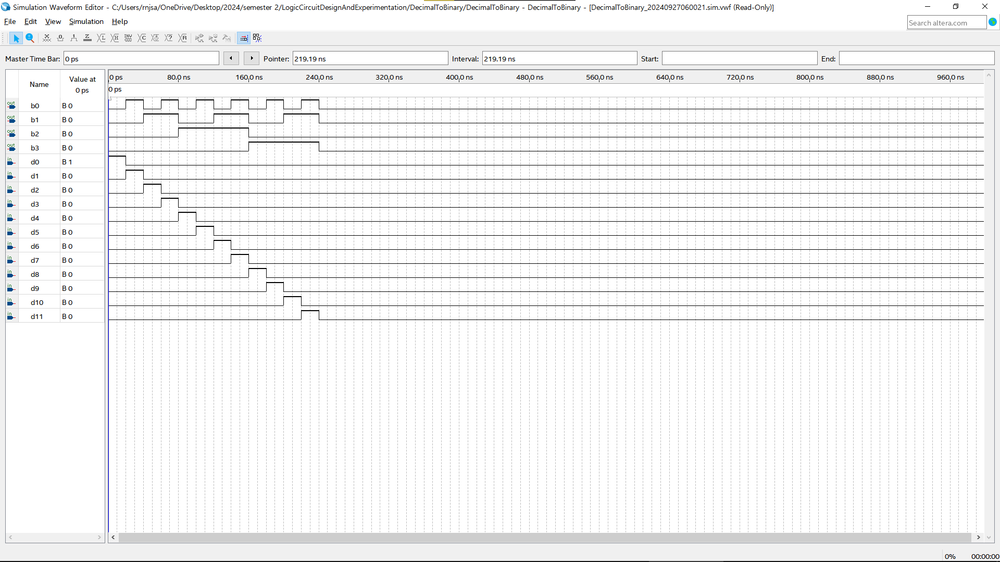

# 논리회로설계및실험(003) <실습 보고서>

제출일: 2024-09-25; 3주차 실습\
이름: 권민규(202355517), 윤태영(202355565) 12조

## 실습 1

### 설계 개요

아래 모듈들을 Symbol화하기

1. Decimal-to-Binary Encoder -> input: (0~11)
2. 2bit Comparator
3. Half Adder
4. Full Adder (Half Adder를 이용해 구현)
5. 4bit Ripple Carry Adder (Full Adder를 이용해 구현)

---

### Hardware Architecture

- Decimal-to-Binary Encoder

- 2bit Comparator

- Half Adder

- Full Adder

- 4bit Ripple Carry Adder

---

### RTL Simulation 결과 분석

- Decimal-to-Binary Encoder

- 2bit Comparator

- Half Adder

- Full Adder

- 4bit Ripple Carry Adder

---

## 실습 2

### 설계 개요

가산기 구현

- 입력 : [11:0] A, [11:0] B
- 출력 : [4:0] Sum
- 입력 A, B는 one-hot code
- A와 B로 입력 받은 두 수를 더하여 5bit의 2진수로 출력한다
- ex) A2, B9 HIGH -> $2+9=11$ 이므로 Sum={01011} 이다
- 4bit 리플 캐리 가산기와 Decimal-to-Binary 회로를 이용하여 구현

---

### Hardware Architecture

---

### RTL Simulation 결과 분석

---

## 실습 3

### 설계 개요

4bit Comparator 구현

- 입력: [3:0] A, [3:0] B
- 출력: Gt, Eq, Lt
- 2bit Comparator 2개를 이용하여 구현

---

### Hardware Architecture

- Schematic Design

---

### RTL Simulation 결과 분석

---
