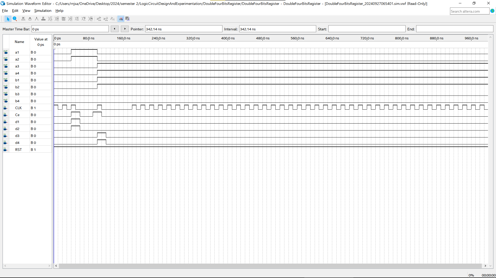

# 논리회로설계및실험(003) <실습 보고서>

제출일: 2024-09-25; 4주차 실습\
이름: 권민규(202355517), 윤태영(202355565) 12조

## 실습 1

### 설계 개요

- Synchronous D Flip-Flop with Asynchronous Reset
- Synchronous D Flip-Flop with Synchronous Reset

---

### Hardware Architecture

- Synchronous D Flip-Flop with Asynchronous Reset

- Synchronous D Flip-Flop with Synchronous Reset

---

### RTL Simulation 결과 분석

- Synchronous D Flip-Flop with Asynchronous Reset

- Synchronous D Flip-Flop with Synchronous Reset

---

## 실습 2

### 설계 개요

- D Flip-Flop with Asynchronous Reset and Clock Enable(Synchronous)

---

### Hardware Architecture

---

### RTL Simulation 결과 분석

---

## 실습 3

### 설계 개요

- 4-bit D Flip-Flop Shift Register

---

### Hardware Architecture

---

### RTL Simulation 결과 분석

---

## 실습 4

### 설계 개요

- 4-bit Register
- with Clock Enable
- 입력: Ce, [3:0] Din, CLK, RST
- 출력: [3:0] Dout

---

### Hardware Architecture

---

### RTL Simulation 결과 분석

---

## 실습 5

### 설계 개요

- 4-bit Register
- with Clock Enable
- with Shift Register
- 입력: Ce, [3:0] Din, CLK, RST
- 출력: [3:0] A, [3:0] B

---

### Hardware Architecture

---

### RTL Simulation 결과 분석

---
